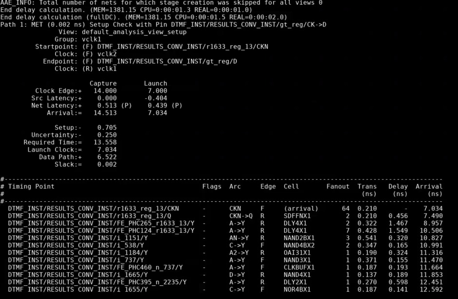
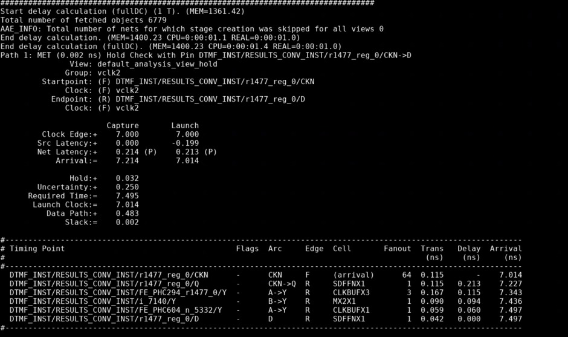
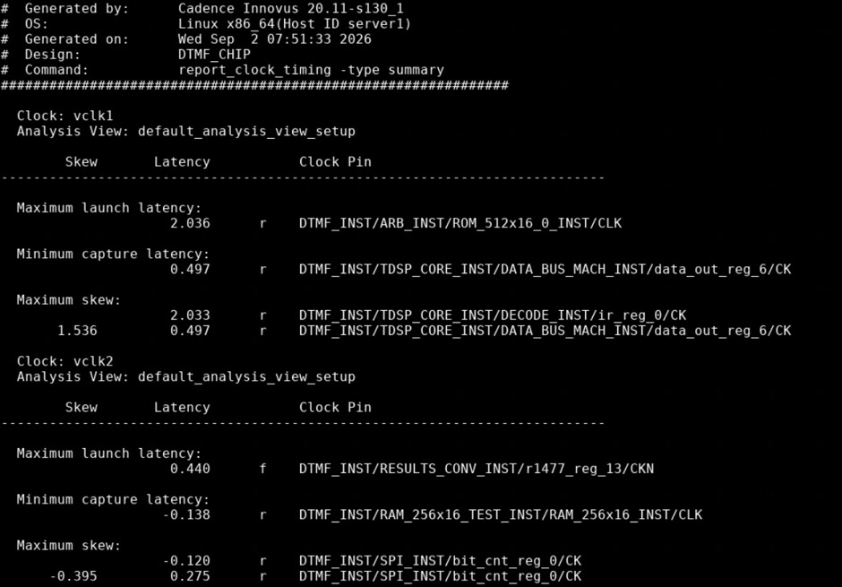
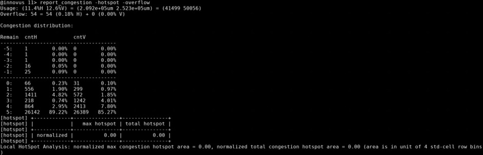
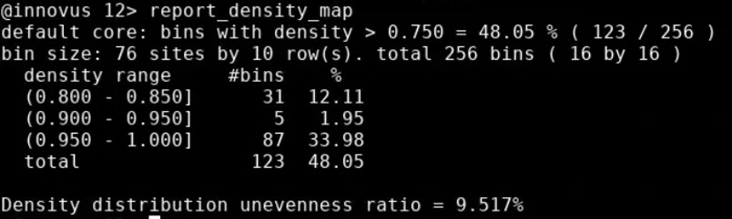
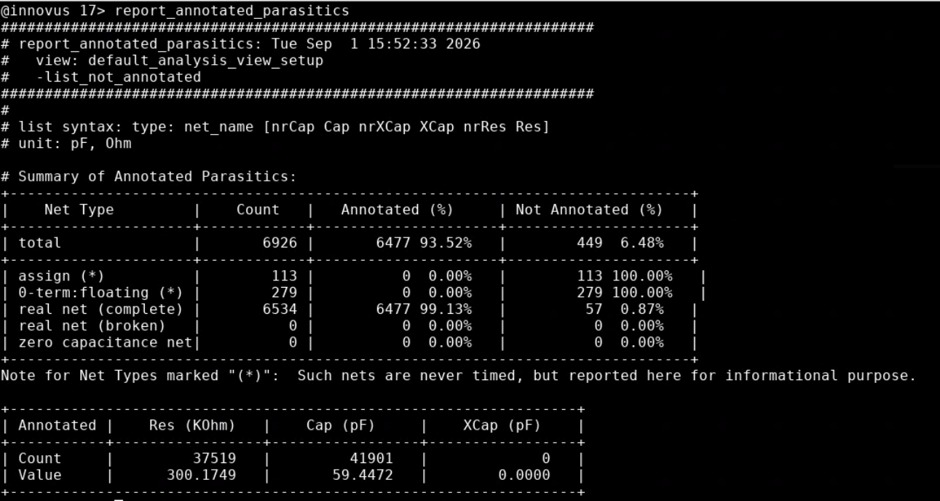
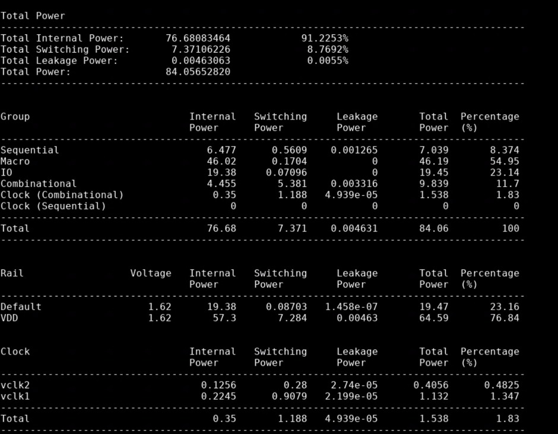

# DTMF_CHIP — 90nm ASIC Physical Design

> **Hierarchical 90nm ASIC Physical Design implementation using Cadence Innovus — covering design initialization, MMMC constraints, floorplanning, power planning, placement, CTS, routing, timing, power, congestion, parasitic and physical-design analysis.**


---

## Table of Contents

- [1. Project Overview](#1-project-overview)
- [2. Project Objectives](#2-project-objectives)
- [3. My Contribution](#3-my-contribution)
- [4. Design at a Glance](#4-design-at-a-glance)
- [5. Design Hierarchy](#5-design-hierarchy)
- [6. Technology and EDA Environment](#6-technology-and-eda-environment)
- [7. Physical Design Flow](#7-physical-design-flow)
- [8. Design Initialization](#8-design-initialization)
- [9. Floorplanning](#9-floorplanning)
- [10. I/O and Macro Placement](#10-io-and-macro-placement)
- [11. Power Planning](#11-power-planning)
- [12. Standard-Cell Placement](#12-standard-cell-placement)
- [13. Pre-CTS Optimization](#13-pre-cts-optimization)
- [14. Clock Tree Synthesis](#14-clock-tree-synthesis)
- [15. Post-CTS Optimization](#15-post-cts-optimization)
- [16. Routing](#16-routing)
- [17. Post-Route Optimization](#17-post-route-optimization)
- [18. Setup Timing Analysis](#18-setup-timing-analysis)
- [19. Hold Timing Analysis](#19-hold-timing-analysis)
- [20. Clock Analysis](#20-clock-analysis)
- [21. Congestion Analysis](#21-congestion-analysis)
- [22. Density Analysis](#22-density-analysis)
- [23. Parasitic Analysis](#23-parasitic-analysis)
- [24. Power Analysis](#24-power-analysis)
- [25. Fanout and DRV Analysis](#25-fanout-and-drv-analysis)
- [26. Timing Coverage](#26-timing-coverage)
- [27. Design Statistics](#27-design-statistics)
- [28. Stage-Wise Implementation Summary](#28-stage-wise-implementation-summary)
- [29. Physical Design Challenges and Debugging](#29-physical-design-challenges-and-debugging)
- [30. Tcl and Innovus Automation](#30-tcl-and-innovus-automation)
- [31. Key Physical Design Concepts Demonstrated](#31-key-physical-design-concepts-demonstrated)
- [32. Repository Structure](#32-repository-structure)
- [33. Limitations and Signoff Status](#33-limitations-and-signoff-status)
- [34. Skills Demonstrated](#34-skills-demonstrated)
- [35. Conclusion](#35-conclusion)
- [36. Author](#36-author)

---

# 1. Project Overview

This project demonstrates an end-to-end **ASIC Physical Design implementation** of a hierarchical `DTMF_CHIP` design using **Cadence Innovus** in a **90nm technology environment**.

The implementation covers the major backend stages required to transform a synthesized digital design into a physically implemented layout:

```text
Design Initialization
        │
        ▼
MMMC / SDC Constraints
        │
        ▼
Floorplanning
        │
        ▼
I/O and Macro Placement
        │
        ▼
Power Planning
        │
        ▼
Standard-Cell Placement
        │
        ▼
Pre-CTS Optimization
        │
        ▼
Clock Tree Synthesis
        │
        ▼
Post-CTS Optimization
        │
        ▼
Global Routing
        │
        ▼
Detailed Routing
        │
        ▼
Post-Route Analysis
        │
        ├── Timing
        ├── Power
        ├── Area
        ├── Congestion
        ├── Density
        ├── Parasitics
        ├── Clock Quality
        └── DRV / Fanout
```

The project focuses on understanding the interaction between **timing, placement, clocking, routing, power, congestion, parasitics and physical constraints** throughout the ASIC backend flow.

---

# 2. Project Objectives

The primary objectives of the project were:

- Implement a hierarchical ASIC physical-design flow for `DTMF_CHIP`.
- Understand the complete RTL/synthesis-to-layout backend methodology.
- Perform floorplanning for a design containing multiple functional blocks and macros.
- Establish a power distribution network using rings, stripes, rails and vias.
- Perform standard-cell placement and placement optimization.
- Build and analyze clock trees for multiple clock domains.
- Perform pre-CTS and post-CTS timing analysis.
- Perform global and detailed routing.
- Analyze setup and hold timing after physical implementation.
- Analyze clock latency, skew, jitter and inter-clock relationships.
- Analyze congestion and placement density.
- Perform post-route parasitic and power analysis.
- Investigate fanout and design-rule-related violations.
- Use Tcl scripting to automate Innovus reporting and physical-design analysis.
- Understand the practical trade-offs between timing, power, area and routability.

---

# 3. My Contribution

The project involved hands-on work across the ASIC physical-design flow, including:

- Design database initialization in Innovus.
- Technology and physical-library setup.
- MMMC and timing-constraint setup.
- Floorplan creation and physical planning.
- Macro-aware physical organization.
- I/O placement.
- Power-ring and power-stripe planning.
- Standard-cell placement.
- Placement-quality and congestion analysis.
- Pre-CTS optimization.
- Clock Tree Synthesis.
- Clock latency and skew analysis.
- Post-CTS optimization.
- Global and detailed routing.
- Post-route timing analysis.
- Setup and hold debugging.
- Power and parasitic analysis.
- Fanout / DRV analysis.
- Timing-coverage analysis.
- Tcl-based report generation and database analysis.

---

# 4. Design at a Glance

| Parameter | Value |
|---|---:|
| **Design** | `DTMF_CHIP` |
| **Technology Node** | 90nm |
| **EDA Tool** | Cadence Innovus |
| **Innovus Version** | 20.11-s130_1 |
| **Timing Methodology** | MMMC |
| **Variation Analysis** | OCV |
| **Total Instances** | 6,149 |
| **Core Instances** | 6,077 |
| **I/O Pad Instances** | 72 |
| **Primary Clock** | `vclk1` |
| **Primary Clock Period** | 7 ns |
| **Primary Clock Frequency** | 142.86 MHz |
| **Secondary Clock** | `vclk2` |
| **Secondary Clock Period** | 14 ns |
| **Secondary Clock Frequency** | 71.43 MHz |
| **Setup WNS** | +0.002 ns |
| **Setup TNS** | 0 ns |
| **Final Hold Slack** | +0.002 ns |
| **Maximum `vclk1` Skew** | 1.536 ns |
| **Inter-Clock Skew** | 2.166 ns |
| **Parasitic Annotation** | 93.52% |

---

# 5. Design Hierarchy

The `DTMF_CHIP` design contains multiple hierarchical functional blocks including DSP, memory, DMA, SPI, test and result-conversion logic.

```text
DTMF_CHIP
│
├── DTMF_INST
│   │
│   ├── ARB_INST
│   ├── DATA_SAMPLE_MUX_INST
│   ├── DIGIT_REG_INST
│   ├── DMA_INST
│   ├── RAM_128x16_TEST_INST
│   ├── RAM_256x16_TEST_INST
│   ├── RESULTS_CONV_INST
│   ├── SPI_INST
│   │
│   ├── TDSP_CORE_INST
│   │   ├── ACCUM_STAT_INST
│   │   ├── ALU_32_INST
│   │   ├── DATA_BUS_MACH_INST
│   │   ├── DECODE_INST
│   │   ├── EXECUTE_INST
│   │   ├── MPY_32_INST
│   │   │   └── M16X16_INST
│   │   ├── PORT_BUS_MACH_INST
│   │   ├── PROG_BUS_MACH_INST
│   │   ├── TDSP_CORE_GLUE_INST
│   │   └── TDSP_CORE_MACH_INST
│   │
│   ├── TDSP_DS_CS_INST
│   ├── TDSP_MUX
│   ├── TEST_CONTROL_INST
│   └── ULAW_LIN_CONV_INST
│
└── IOPADS_INST
```

## Major Functional Blocks

| Block | Role |
|---|---|
| `ARB_INST` | Arbitration and control logic |
| `DATA_SAMPLE_MUX_INST` | Data sampling and multiplexing |
| `DIGIT_REG_INST` | Digit/register storage |
| `DMA_INST` | Direct Memory Access |
| `RAM_128x16_TEST_INST` | 128 × 16 memory/test block |
| `RAM_256x16_TEST_INST` | 256 × 16 memory/test block |
| `RESULTS_CONV_INST` | Result conversion logic |
| `SPI_INST` | Serial Peripheral Interface |
| `TDSP_CORE_INST` | Main DSP processing core |
| `ALU_32_INST` | 32-bit arithmetic logic unit |
| `MPY_32_INST` | 32-bit multiplier |
| `M16X16_INST` | 16 × 16 multiplier |
| `TEST_CONTROL_INST` | Test-mode control |
| `IOPADS_INST` | I/O pad structures |

---

# 6. Technology and EDA Environment

| Category | Configuration |
|---|---|
| Technology | 90nm |
| Place and Route | Cadence Innovus |
| Innovus Version | 20.11-s130_1 |
| Timing Analysis | Innovus STA |
| Constraint Methodology | SDC |
| Multi-Mode Multi-Corner | MMMC |
| Variation Methodology | OCV |
| Parasitic Analysis | Post-route RC / SPEF-based analysis |
| Automation | Tcl |
| Operating Environment | Linux |

The implementation was performed using a conventional **ASIC physical-design methodology**, with timing constraints and implementation views defined before physical optimization.

---

# 7. Physical Design Flow

The complete physical-design sequence followed in this project is:

```text
                 ┌──────────────────────┐
                 │ Design Initialization│
                 └──────────┬───────────┘
                            │
                            ▼
                 ┌──────────────────────┐
                 │ MMMC / SDC Setup    │
                 └──────────┬───────────┘
                            │
                            ▼
                 ┌──────────────────────┐
                 │   Floorplanning      │
                 └──────────┬───────────┘
                            │
                            ▼
                 ┌──────────────────────┐
                 │ I/O / Macro Planning │
                 └──────────┬───────────┘
                            │
                            ▼
                 ┌──────────────────────┐
                 │   Power Planning     │
                 └──────────┬───────────┘
                            │
                            ▼
                 ┌──────────────────────┐
                 │ Standard-Cell Place  │
                 └──────────┬───────────┘
                            │
                            ▼
                 ┌──────────────────────┐
                 │ Pre-CTS Optimization │
                 └──────────┬───────────┘
                            │
                            ▼
                 ┌──────────────────────┐
                 │        CTS           │
                 └──────────┬───────────┘
                            │
                            ▼
                 ┌──────────────────────┐
                 │ Post-CTS Optimization│
                 └──────────┬───────────┘
                            │
                            ▼
                 ┌──────────────────────┐
                 │ Global / Detail Route│
                 └──────────┬───────────┘
                            │
                            ▼
                 ┌──────────────────────┐
                 │ Post-Route Analysis  │
                 └──────────────────────┘
```

---

# 8. Design Initialization

The design initialization stage establishes the physical and logical databases required by Innovus.

Major activities included:

- Loading the technology LEF.
- Loading standard-cell LEF information.
- Loading macro and I/O physical information.
- Loading timing libraries.
- Defining the logical netlist.
- Defining power and ground nets.
- Loading MMMC configuration.
- Reading SDC constraints.
- Initializing the design database.

Typical Innovus initialization concepts included:

```tcl
set_db init_power_nets VDD
set_db init_ground_nets VSS
```

Physical library information was loaded before creating the floorplan.

### Initialization Objectives

- Ensure logical and physical libraries are consistent.
- Establish correct power/ground connectivity.
- Load valid timing views.
- Define clock constraints.
- Prepare the design database for physical implementation.

---

# 9. Floorplanning

Floorplanning defines the physical canvas in which the design is implemented.

The floorplan stage considered:

- Die dimensions.
- Core dimensions.
- Core utilization.
- Standard-cell rows.
- Macro locations.
- I/O locations.
- Routing channels.
- Placement regions.
- Macro accessibility.
- Power-distribution requirements.

### Floorplanning Objectives

The primary objectives were:

- Provide sufficient area for standard-cell placement.
- Maintain routing access around macros.
- Avoid excessive local density.
- Provide sufficient space for power distribution.
- Maintain reasonable wirelength.
- Prepare a physically routable architecture.

### Floorplan View

> Add your actual Innovus floorplan screenshot here.

```text

```

### Physical Interpretation

Macro placement has a direct effect on:

- Data-path wirelength.
- Routing congestion.
- Timing.
- Power-grid connectivity.
- Clock distribution.
- Availability of routing channels.

Therefore, floorplanning was treated as a timing and routability problem rather than simply an area-allocation step.

---

# 10. I/O and Macro Placement

The design contains a significant number of hierarchical blocks and macro-related structures.

I/O and macro planning considered:

- Logical connectivity.
- Pin accessibility.
- Critical-path proximity.
- Routing channels.
- Power connections.
- Macro-to-macro communication.
- Standard-cell placement area.

### Macro Placement Considerations

```text
Macro Placement
      │
      ├── Timing
      ├── Congestion
      ├── Wirelength
      ├── Pin Accessibility
      ├── Power Connectivity
      └── Routing Resources
```

The objective was to prevent macro placement from creating routing bottlenecks that would later become difficult to resolve during placement and routing.

### Macro / I/O View

> Add your actual screenshot here.

```text

```

---

# 11. Power Planning

A power distribution network was constructed to distribute `VDD` and `VSS` across the physical design.

The power-plan stage included:

- Core power rings.
- Power stripes.
- Standard-cell power rails.
- Macro power connectivity.
- Power vias.
- VDD/VSS connectivity.

### Power Planning Concept

```text
                 VDD / VSS
                    │
                    ▼
             Core Power Rings
                    │
                    ▼
             Vertical Stripes
                    │
                    ▼
            Horizontal Stripes
                    │
                    ▼
             Standard-Cell Rails
                    │
                    ▼
               Cell Power Pins
```

### Power Planning Objectives

- Provide low-resistance power paths.
- Maintain robust VDD/VSS connectivity.
- Reduce IR-drop risk.
- Improve electromigration robustness.
- Ensure macro and standard-cell power connectivity.
- Provide sufficient via connectivity between power layers.

### Power Plan View

```text

```

---

# 12. Standard-Cell Placement

After floorplanning and power planning, standard cells were placed within the available core area.

Placement quality was evaluated using:

- Cell density.
- Timing.
- Congestion.
- Wirelength.
- Macro accessibility.
- Routing demand.
- Physical legality.

### Placement Objectives

- Achieve legal placement.
- Maintain acceptable cell density.
- Reduce critical-path wirelength.
- Avoid congestion hotspots.
- Preserve routing access around macros.
- Prepare a suitable physical topology for CTS.

### Placement View

```text

```

### Placement Analysis

Placement is one of the most important stages because it establishes the physical relationship between:

```text
Cells
 ↓
Nets
 ↓
Wirelength
 ↓
RC
 ↓
Timing
 ↓
Power
 ↓
Congestion
```

A poor placement can result in long nets, high capacitance, increased delay, congestion and difficult timing closure.

---

# 13. Pre-CTS Optimization

Before clock tree synthesis, timing and physical quality were analyzed using estimated clock characteristics.

The pre-CTS stage was used to identify:

- Setup violations.
- Hold violations.
- High-fanout nets.
- Long critical paths.
- Transition violations.
- Congestion problems.
- Poor placement around timing-critical logic.

### Optimization Techniques

Potential optimization mechanisms include:

- Cell upsizing.
- Buffer insertion.
- Gate restructuring.
- Placement optimization.
- Fanout optimization.
- Critical-path optimization.

### Pre-CTS Analysis

```text
Placement
    │
    ▼
Timing Analysis
    │
    ├── Setup
    ├── Hold
    ├── Transition
    └── Fanout
    │
    ▼
Optimization
    │
    ▼
Re-analysis
```

```text

```

---

# 14. Clock Tree Synthesis

Clock Tree Synthesis was performed to distribute clock signals to sequential elements while controlling clock latency, skew, transition and insertion delay.

The design contains multiple clock domains, including:

```text
vclk1
vclk2
```

### CTS Objectives

- Reduce clock skew.
- Control insertion delay.
- Maintain acceptable clock transition.
- Balance launch and capture paths.
- Avoid excessive clock-tree buffering.
- Maintain setup and hold timing.
- Control clock power.

### Clock Summary

| Clock | Period | Frequency |
|---|---:|---:|
| `vclk1` | 7 ns | 142.86 MHz |
| `vclk2` | 14 ns | 71.43 MHz |

### `vclk1` Clock Results

```text
Maximum Launch Latency   = 2.036 ns
Minimum Capture Latency  = 0.497 ns
Maximum Skew             = 1.536 ns
```

### Inter-Clock Analysis

```text
Clock Relationship = vclk1 → vclk2
Inter-Clock Skew   = 2.166 ns
```

### Clock Tree View

```text

```

### CTS Interpretation

Clock skew directly affects the available timing budget between launch and capture registers.

For setup analysis:

```text
Positive Skew
    │
    └── Generally provides more setup margin
```

For hold analysis:

```text
Positive Skew
    │
    └── Can reduce hold margin
```

Therefore, CTS optimization must balance setup and hold requirements rather than optimizing skew in isolation.

---

# 15. Post-CTS Optimization

Post-CTS optimization was performed after actual clock-tree insertion.

At this stage, timing analysis becomes more realistic because clock latency and skew are represented by the implemented clock network.

The analysis considered:

- Clock insertion delay.
- Clock skew.
- Setup timing.
- Hold timing.
- Transition.
- Fanout.
- Clock-tree buffering.
- Data-path delay.

### Post-CTS Optimization Flow

```text
CTS
 │
 ▼
Clock Latency / Skew
 │
 ▼
Timing Analysis
 │
 ├── Setup
 ├── Hold
 └── DRV
 │
 ▼
Optimization
 │
 ▼
Re-analysis
```

```text

```

---

# 16. Routing

Routing converts the placed design into an electrically connected physical implementation.

The routing process included:

- Global routing.
- Detailed routing.
- Signal routing.
- Clock routing.
- Via insertion.
- Post-route optimization.

### Routing Objectives

- Complete all required connections.
- Minimize routing violations.
- Control wirelength.
- Reduce parasitic effects.
- Maintain timing.
- Preserve power-grid connectivity.
- Avoid excessive congestion.

### Routing View

```text

```

### Routing Flow

```text
Placed Design
      │
      ▼
Global Routing
      │
      ▼
Route Optimization
      │
      ▼
Detailed Routing
      │
      ▼
Parasitic Extraction
      │
      ▼
Post-Route STA
```

---

# 17. Post-Route Optimization

After routing, the design was analyzed using post-route physical information.

Post-route optimization considered:

- Extracted parasitics.
- Setup timing.
- Hold timing.
- Fanout.
- Transition.
- Routing congestion.
- Power.
- Clock quality.

Post-route analysis is particularly important because interconnect resistance and capacitance can significantly alter timing compared with pre-route estimates.

---

# 18. Setup Timing Analysis

Final setup timing analysis reported:

```text
Setup WNS = +0.002 ns
Setup TNS =  0.000 ns
FEP       =  0
```

### Representative Setup Path

```text
Startpoint:
DTMF_INST/RESULTS_CONV_INST/r1633_reg_13/CK

Endpoint:
DTMF_INST/RESULTS_CONV_INST/gt_reg/D

Clock:
vclk1

Setup Slack:
+0.002 ns
```

### Setup Timing Concept

The setup requirement ensures that data reaches the capture register sufficiently before the active capture edge.

A simplified setup relationship is:

```text
Tclk ≥ Tcq + Tcomb + Tsetup + Clock Uncertainty
```

Physical implementation affects:

- Cell delay.
- Net delay.
- Clock latency.
- Clock skew.
- Parasitic capacitance.
- Routing resistance.

Therefore, setup closure is a combined logical and physical-design problem.

### Setup Report

```text

```

---

# 19. Hold Timing Analysis

Hold timing was analyzed after clock-tree implementation and physical optimization.

An earlier implementation state showed a significant hold violation:

```text
Initial Hold Slack ≈ -1.99 ns
```

A later analyzed implementation reported:

```text
Final Hold Slack = +0.002 ns
```

This demonstrates the effect of physical-design optimization on short-path timing.

### Hold Timing Concept

The hold requirement can be simplified as:

```text
Tcq(min) + Tdata(min) ≥ Thold + Clock Skew Effects
```

Hold violations can be affected by:

- Very short data paths.
- Clock skew.
- Cell delay.
- Routing delay.
- Buffering.
- Physical proximity of launch and capture cells.

### Hold Optimization

Common hold-fix techniques include:

- Delay-cell insertion.
- Buffer insertion.
- Down-sizing.
- Routing detours.
- Controlled data-path delay.

### Hold Report

```text

```

---

# 20. Clock Analysis

Clock analysis was performed to evaluate the quality of the implemented clock network.

### Clock Metrics

| Metric | Result |
|---|---:|
| `vclk1` Period | 7 ns |
| `vclk1` Frequency | 142.86 MHz |
| `vclk2` Period | 14 ns |
| `vclk2` Frequency | 71.43 MHz |
| Maximum `vclk1` Skew | 1.536 ns |
| Inter-Clock Skew | 2.166 ns |
| Maximum Launch Latency | 2.036 ns |
| Minimum Capture Latency | 0.497 ns |

### Clock Quality Checks

```text
Minimum Pulse Width WNS = +1.569 ns
Minimum Period WNS      = +3.709 ns
```

### Clock Analysis View

```text

```

---

# 21. Congestion Analysis

Routing congestion was analyzed after physical implementation.

Reported routing utilization:

```text
Horizontal Usage ≈ 11.4%
Vertical Usage   ≈ 12.6%
```

Overflow:

```text
Horizontal Overflow = 54
Vertical Overflow   = 0
```

Hotspot metrics:

```text
Maximum Normalized Hotspot Area = 0.00
Total Normalized Hotspot Area   = 0.00
```

### Interpretation

The overall routing utilization is relatively low, while localized horizontal overflow indicates areas that can still benefit from physical optimization.

Congestion is influenced by:

- Cell density.
- Macro placement.
- Pin density.
- Routing-layer availability.
- High-fanout nets.
- Clock-tree routing.
- Long interconnects.

### Congestion Map

```text

```

---

# 22. Density Analysis

Placement density was analyzed to identify regions with concentrated standard-cell utilization.

Reported values:

```text
Density Threshold        = 0.750
High-Density Bins        = 123
Total Bins               = 256
High-Density Area        = 48.05%
Density Unevenness Ratio = 9.517%
```

### Density Interpretation

High local density can increase:

- Routing demand.
- Wirelength.
- Congestion.
- Timing difficulty.
- Placement optimization difficulty.

Therefore, density analysis is an important physical-quality metric even when total utilization appears acceptable.

### Density Map

```text

```

---

# 23. Parasitic Analysis

Post-route parasitic analysis was performed to evaluate the extracted resistance and capacitance associated with routed interconnects.

### Parasitic Annotation

```text
Total Nets               = 6,926
Annotated Nets           = 6,477
Annotated Percentage     = 93.52%

Not Annotated Nets       = 449
Not Annotated Percentage = 6.48%
```

### Aggregate Parasitics

```text
Resistance  ≈ 300.1749 KΩ
Capacitance ≈ 59.4472 pF
```

### Why Parasitics Matter

Interconnect parasitics influence:

- Cell-to-cell delay.
- Slew.
- Setup timing.
- Hold timing.
- Dynamic power.
- Clock latency.
- Crosstalk behavior.

Therefore, post-route timing is more representative of the actual physical implementation than idealized pre-route timing.

### Parasitic Analysis

```text

```

---

# 24. Power Analysis

Post-route power analysis reported:

```text
Internal Power  = 76.6808
Switching Power = 7.3711
Leakage Power   = 0.004631

Total Power     = 84.0565
```

## Power Breakdown

| Group | Internal | Switching | Leakage | Total | Contribution |
|---|---:|---:|---:|---:|---:|
| Sequential | 6.477 | 0.5609 | 0.001265 | 7.039 | 8.374% |
| Macro | 46.02 | 0.1704 | 0 | 46.19 | 54.95% |
| I/O | 19.38 | 0.07096 | 0 | 19.45 | 23.14% |
| Combinational | 4.455 | 5.381 | 0.003316 | 9.839 | 11.70% |
| Clock | 0.350 | 1.188 | 0.00004939 | 1.538 | 1.83% |

### Rail-Level Power

```text
Default Rail Total Power ≈ 19.47
VDD Rail Total Power     ≈ 64.59
```

### Power Interpretation

The power breakdown shows that macro and I/O structures contribute a significant portion of the reported total power.

Combinational logic contributes a comparatively larger switching component, while sequential logic contains both internal and switching activity.

Clock power is also reported separately because the clock network can become a significant contributor in high-performance designs.

### Power Report

```text

```

---

# 25. Fanout and DRV Analysis

Maximum-fanout analysis reported:

```text
Maximum Fanout WNS = -85.000
Maximum Fanout TNS = -1623.000
FEP                = 141
```

These violations indicate that fanout optimization remains an area for further physical implementation improvement.

### Possible Optimization Techniques

- Buffer insertion.
- Fanout splitting.
- Driver upsizing.
- Placement optimization.
- Net restructuring.
- Logical hierarchy review.
- Constraint verification.

### Engineering Significance

High fanout can cause:

```text
High Fanout
    ↓
Higher Capacitance
    ↓
Larger RC Delay
    ↓
Poor Transition
    ↓
Timing Degradation
    ↓
Higher Buffering / Power
```

Fanout analysis is therefore closely related to timing, power and physical implementation quality.

---

# 26. Timing Coverage

Timing-analysis coverage reported the following:

| Check Type | Total | Met | Violated | Untested |
|---|---:|---:|---:|---:|
| Clock Period | 6 | 6 | 0 | 0 |
| External Delay (Late) | 25 | 9 | 0 | 16 |
| Pulse Width | 1361 | 1088 | 0 | 273 |
| Recovery | 269 | 0 | 0 | 269 |
| Setup | 1821 | 219 | 0 | 1602 |

### Interpretation

The coverage report is useful for determining not only whether a displayed timing check is clean, but also **how much of the design has actually been analyzed**.

A complete signoff assessment must consider:

- Constraint completeness.
- Timing coverage.
- Mode/corner coverage.
- Recovery/removal checks.
- Clock-domain relationships.
- Unconstrained paths.
- DRV status.

---

# 27. Design Statistics

### Instance Statistics

```text
Total Instances = 6,149
Core Instances  = 6,077
I/O Pads        = 72
```

### Reported Area

```text
Reported Area = 1,284,833.181
```

### Clock Domains

```text
vclk1 = 7 ns  → 142.86 MHz
vclk2 = 14 ns → 71.43 MHz
```

### Timing

```text
Setup WNS = +0.002 ns
Setup TNS = 0 ns
Hold Slack = +0.002 ns
```

### Routing

```text
Horizontal Usage ≈ 11.4%
Vertical Usage   ≈ 12.6%

Horizontal Overflow = 54
Vertical Overflow   = 0
```

### Parasitics

```text
Annotated Nets = 6,477 / 6,926
Annotation     = 93.52%
```

---

# 28. Stage-Wise Implementation Summary

| Stage | Main Objective | Primary Checks |
|---|---|---|
| Initialization | Build design database | Libraries, netlist, MMMC |
| Floorplan | Establish physical architecture | Area, utilization, macros |
| Power Plan | Establish VDD/VSS network | Connectivity, rings, stripes |
| Placement | Physically distribute cells | Density, timing, congestion |
| Pre-CTS | Optimize before clock insertion | Setup, hold, DRV |
| CTS | Build balanced clock network | Skew, latency, transition |
| Post-CTS | Optimize with real clock tree | Setup, hold, clock quality |
| Global Route | Determine routing topology | Congestion, overflow |
| Detailed Route | Complete physical connectivity | DRC, vias, connectivity |
| Post-Route | Analyze extracted implementation | STA, power, parasitics |
| Final Analysis | Evaluate implementation quality | Timing, power, area, DRV |

---

# 29. Physical Design Challenges and Debugging

A major objective of this project was to understand physical-design problems encountered during implementation rather than only obtaining a final database.

## 29.1 Hold Timing Debugging

The implementation initially exhibited a significant hold violation.

```text
Initial Hold Slack ≈ -1.99 ns
```

The path was analyzed by considering:

- Launch clock latency.
- Capture clock latency.
- Clock skew.
- Data-path delay.
- Cell delay.
- Net delay.
- Physical distance between cells.

After optimization, a later analysis reported:

```text
Final Hold Slack = +0.002 ns
```

This demonstrates the iterative nature of timing closure.

---

## 29.2 Fanout Debugging

High-fanout violations were identified in the design.

The analysis focused on:

```text
Fanout
  ↓
Load Capacitance
  ↓
Transition
  ↓
Cell Delay
  ↓
Timing
```

Possible fixes were evaluated through buffering, sizing and placement optimization.

---

## 29.3 Congestion Debugging

Localized routing overflow was observed primarily in the horizontal direction.

Debugging involved examining:

- Placement density.
- Macro locations.
- Pin density.
- Routing demand.
- Routing resources.
- High-fanout nets.

The objective was to understand whether congestion originated from the floorplan, placement or routing topology.

---

## 29.4 Clock Debugging

Clock analysis focused on:

- Clock latency.
- Clock skew.
- Inter-clock skew.
- Pulse width.
- Period.
- Launch/capture relationships.

The implemented `vclk1` clock showed:

```text
Maximum Skew = 1.536 ns
```

while the reported inter-clock skew between the analyzed domains was:

```text
Inter-Clock Skew = 2.166 ns
```

---

## 29.5 Parasitic Debugging

Post-route parasitic annotation was checked to determine how much of the routed design had extracted RC information.

```text
Annotated = 93.52%
Unannotated = 6.48%
```

This information was used when interpreting post-route timing and power results.

---

# 30. Tcl and Innovus Automation

Tcl was used to automate physical-design reporting and database analysis.

Representative analysis commands include:

```tcl
report_area

report_congestion -hotspot -overflow

report_density_map

report_power

report_timing

report_timing_summary

report_timing -unconstrained

report_clock_timing -type latency

report_clock_timing -type skew

report_clock_timing -type jitter

report_clock_timing -type summary

report_clock_timing -type interclock_skew

report_analysis_coverage

report_annotated_delay

report_annotated_parasitics
```

### Automation Objectives

The reporting scripts were intended to:

- Extract implementation metrics.
- Reduce repetitive manual analysis.
- Generate consistent reports.
- Query Innovus database objects.
- Track physical-design quality.
- Simplify debugging.

### Example Database Queries

```tcl
set current_design [get_db designs .name]

set inst_count [llength [get_db insts]]

set hierarchical_inst_count [llength [get_db hinsts]]
```

The automation approach can be extended to generate stage-wise implementation dashboards containing:

```text
Area
Utilization
Instance Count
Timing
Power
Clock Skew
Clock Latency
Congestion
Density
Fanout
Parasitics
DRVs
```

---

# 31. Key Physical Design Concepts Demonstrated

## Floorplanning

- Die and core definition.
- Core utilization.
- Macro placement.
- I/O placement.
- Placement regions.
- Routing channels.
- Physical hierarchy.

## Power Planning

- VDD/VSS rings.
- Power stripes.
- Standard-cell rails.
- Macro power connectivity.
- Power vias.
- Power-grid robustness.

## Placement

- Standard-cell placement.
- Density analysis.
- Timing-driven placement.
- Congestion analysis.
- Wirelength considerations.
- Macro-aware placement.

## Clock Tree Synthesis

- Clock latency.
- Clock skew.
- Clock insertion delay.
- Clock transition.
- Launch/capture latency.
- Inter-clock skew.
- Pulse-width analysis.

## Routing

- Global routing.
- Detailed routing.
- Signal routing.
- Clock routing.
- Via insertion.
- Post-route optimization.

## Timing

- Setup analysis.
- Hold analysis.
- Static Timing Analysis.
- MMMC.
- OCV.
- Clock uncertainty.
- Clock skew.
- Timing coverage.

## Power

- Internal power.
- Switching power.
- Leakage power.
- Clock power.
- Rail-level power.
- Post-route power analysis.

## Physical Verification / Analysis

- Congestion.
- Density.
- Fanout.
- DRV.
- Parasitic annotation.
- Routing overflow.
- Physical implementation quality.

---

# 32. Repository Structure

The recommended repository organization for the complete project is:

```text
-DTMF-CHIP---90nm-ASIC-Physical-Design/
│
├── README.md
│
├── constraints/
│   ├── clocks.sdc
│   └── constraints.sdc
│
├── scripts/
│   ├── init.tcl
│   ├── floorplan.tcl
│   ├── power_plan.tcl
│   ├── placement.tcl
│   ├── cts.tcl
│   ├── routing.tcl
│   └── reports.tcl
│
├── reports/
│   ├── area/
│   ├── timing/
│   ├── power/
│   ├── clock/
│   ├── congestion/
│   └── parasitics/
│
├── screenshots/
│   ├── 01_floorplan.png
│   ├── 02_macro_io_placement.png
│   ├── 03_power_plan.png
│   ├── 04_placement.png
│   ├── 05_pre_cts.png
│   ├── 06_clock_tree.png
│   ├── 07_post_cts.png
│   ├── 08_routing.png
│   ├── 09_setup_timing.png
│   ├── 10_hold_timing.png
│   ├── 11_clock_timing.png
│   ├── 12_congestion.png
│   ├── 13_density_map.png
│   ├── 14_parasitics.png
│   └── 15_power.png
│
├── docs/
│   └── physical_design_notes.md
│
├── .gitignore
│
└── LICENSE
```

> **Repository note:** Keep only directories and files that actually exist in the repository. The structure above is a recommended organization for the project.

---

# 33. Limitations and Signoff Status

The reported results represent the analyzed implementation state of the project.

The design demonstrates a substantial physical-design flow, but the following points should be considered before describing the implementation as complete production signoff:

- Fanout violations remain in the reported analysis.
- Some timing checks are reported as untested.
- Recovery checks require further analysis.
- Horizontal routing overflow remains.
- Full signoff requires complete MMMC coverage.
- Full physical verification requires comprehensive DRC/LVS verification.
- Power-integrity signoff requires dedicated IR-drop and EM analysis.
- Final signoff also requires complete antenna, density, via and manufacturing-rule verification.

Therefore, this repository should be presented as a **hands-on ASIC Physical Design implementation and analysis project**, rather than a production-qualified signoff database.

This distinction is important when documenting engineering work professionally.

---

# 34. Skills Demonstrated

### EDA

- Cadence Innovus
- ASIC Physical Design
- Static Timing Analysis
- MMMC
- OCV
- Post-route analysis

### Physical Design

- Floorplanning
- Macro placement
- I/O placement
- Power planning
- Placement
- CTS
- Routing
- Timing optimization
- Congestion analysis
- Density analysis
- Parasitic analysis
- Power analysis
- DRV analysis

### Scripting

- Tcl
- Innovus database queries
- Automated report generation
- Physical-design metric extraction
- Flow automation

### Timing

- Setup
- Hold
- Clock latency
- Clock skew
- Inter-clock skew
- Pulse width
- Timing coverage
- Fanout

---

# 35. Conclusion

This project provided hands-on experience with the physical implementation of a hierarchical ASIC design in a **90nm technology environment using Cadence Innovus**.

The implementation covered the complete physical-design sequence:

```text
Initialization
      ↓
Floorplanning
      ↓
Power Planning
      ↓
Placement
      ↓
Pre-CTS Optimization
      ↓
Clock Tree Synthesis
      ↓
Post-CTS Optimization
      ↓
Routing
      ↓
Post-Route Analysis
      ↓
Timing / Power / Physical Analysis
```

The project demonstrates practical understanding of how physical-design decisions affect:

```text
                    ┌───────────┐
                    │  Timing   │
                    └─────┬─────┘
                          ↕
                    ┌───────────┐
                    │ Placement │
                    └─────┬─────┘
                          ↕
                    ┌───────────┐
                    │ Congestion│
                    └─────┬─────┘
                          ↕
                    ┌───────────┐
                    │ Routing   │
                    └─────┬─────┘
                          ↕
                    ┌───────────┐
                    │ Parasitics│
                    └─────┬─────┘
                          ↕
                    ┌───────────┐
                    │  Power    │
                    └───────────┘
```

Rather than focusing only on final numbers, the project documents the **implementation flow, physical-design decisions, analysis methodology, debugging process and optimization challenges** encountered throughout the backend flow.

---

# 36. Author

## K V Surya Vineeth

**B.Tech — Electronics & Communication Engineering**

### Areas of Interest

`ASIC Physical Design` · `VLSI` · `Static Timing Analysis` · `Cadence Innovus` · `Tcl Automation` · `Backend Design`

---

## Project Focus

```text
┌──────────────────────────────────────────────┐
│             DTMF_CHIP — 90nm                 │
│                                              │
│  Floorplan → Power Plan → Placement → CTS   │
│                                              │
│  Routing → STA → Power → Congestion         │
│                                              │
│  Parasitics → DRV → Tcl Automation           │
│                                              │
└──────────────────────────────────────────────┘
```

---

> **Portfolio Project — ASIC Physical Design | Cadence Innovus | 90nm**
