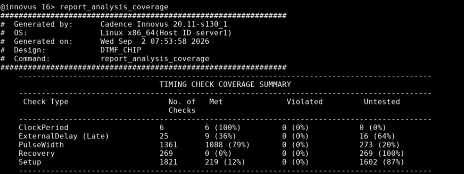
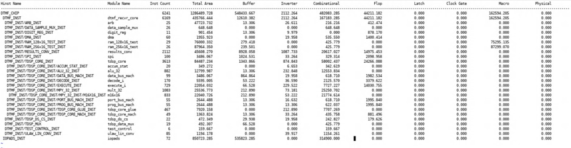
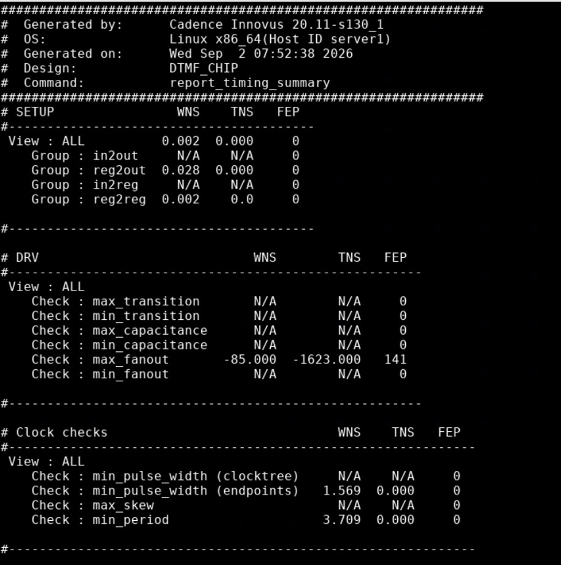

# DTMF_CHIP — 90nm ASIC Physical Design

**Hierarchical Full-Chip ASIC Physical Design using Cadence Innovus**

**90nm CMOS | MMMC/OCV | Floorplanning | Power Planning | Placement | CTS | Routing | STA | Power | Congestion | Parasitic Analysis**

<p align="center">
  
  
  
  
  
</p>

---

## Project Snapshot

| Parameter | Value |
|---|---|
| Design | `DTMF_CHIP` |
| Technology | 90nm CMOS |
| Physical Design Tool | Cadence Innovus 20.11-s130_1 |
| Analysis | MMMC / OCV |
| Supply Voltage | 1.62 V |
| Main Clock | `vclk1` |
| Secondary Clock | `vclk2` |
| `vclk1` Period | 7 ns |
| `vclk1` Frequency | 142.857 MHz |
| `vclk2` Period | 14 ns |
| `vclk2` Frequency | 71.429 MHz |
| Final Instances | 6,149 |
| DTMF Core Instances | 6,077 |
| I/O Instances | 72 |
| Reported Total Area | 1,284,833.181 |
| Setup WNS | +0.002 ns |
| Setup TNS | 0 ns |
| Setup FEP | 0 |
| Representative Hold Slack | +0.002 ns |
| Total Power | ~84.06 |
| Parasitic Net Annotation | 93.52% |

---

## Table of Contents

- [Introduction](#introduction)
- [Project Objectives](#project-objectives)
- [What I Implemented](#what-i-implemented)
- [Design Hierarchy](#design-hierarchy)
- [Tools and Technology](#tools-and-technology)
- [Design Constraints](#design-constraints)
- [Physical Design Flow](#physical-design-flow)
- [1. Design Initialization](#1-design-initialization)
- [2. Floorplanning](#2-floorplanning)
- [3. I/O and Macro Placement](#3-io-and-macro-placement)
- [4. Power Planning](#4-power-planning)
- [5. Placement](#5-placement)
- [6. Pre-CTS Optimization](#6-pre-cts-optimization)
- [7. Clock Tree Synthesis](#7-clock-tree-synthesis)
- [8. Routing](#8-routing)
- [9. Post-Route Timing Analysis](#9-post-route-timing-analysis)
- [10. Clock Analysis](#10-clock-analysis)
- [11. Congestion and Density](#11-congestion-and-density)
- [12. Power Analysis](#12-power-analysis)
- [13. Parasitic Analysis](#13-parasitic-analysis)
- [14. Timing Coverage and DRV](#14-timing-coverage-and-drv)
- [15. Area and Design Statistics](#15-area-and-design-statistics)
- [16. Physical Design Challenges](#16-physical-design-challenges)
- [17. Tcl / Innovus Automation](#17-tcl--innovus-automation)
- [Physical Design Stage Summary](#physical-design-stage-summary)
- [Final Implementation Results](#final-implementation-results)
- [Repository Structure](#repository-structure)
- [Project Status](#project-status)

---

# Introduction

This project demonstrates the **ASIC physical design implementation of the hierarchical `DTMF_CHIP` design in a 90nm CMOS technology environment using Cadence Innovus**.

The project focuses on the backend physical implementation flow and documents the transition from the initialized design database through:

```text
Design Initialization
        ↓
Floorplanning
        ↓
I/O & Macro Placement
        ↓
Power Planning
        ↓
Standard-Cell Placement
        ↓
Pre-CTS Optimization
        ↓
Clock Tree Synthesis
        ↓
Routing
        ↓
Post-Route Timing / Power / Physical Analysis
```

The implementation contains a substantial hierarchical digital processing core together with memory/test macros, I/O pads, SPI logic, data-path/control logic, and clock-related structures.

The primary focus is on understanding how **floorplan, placement, clocking, routing, timing, power, congestion, parasitics, and design-rule constraints interact during physical implementation**.

---

# Project Objectives

The main objectives of this project were:

- Implement a hierarchical ASIC physical-design flow using Cadence Innovus.
- Initialize the design with technology, physical, timing, and constraint information.
- Analyze the hierarchical design structure and physical floorplan.
- Perform I/O and macro placement.
- Build the VDD/VSS power-distribution network.
- Perform standard-cell placement and optimization.
- Prepare the design for CTS.
- Build and analyze the clock tree.
- Perform global and detailed routing.
- Analyze post-route setup and hold timing.
- Analyze clock latency, skew, jitter, and inter-clock skew.
- Evaluate routing congestion and placement density.
- Analyze internal, switching, and leakage power.
- Analyze post-route parasitic annotation.
- Evaluate timing-analysis coverage.
- Identify remaining DRV/fanout and routing issues.
- Use Tcl scripting to automate implementation analysis and reporting.

---

# What I Implemented

The physical-design work covered:

- Design initialization and library setup
- MMMC / OCV timing environment
- SDC-based constraints
- Hierarchical floorplanning
- I/O planning
- Memory and clock-related macro placement
- Power rings and power stripes
- Standard-cell placement
- Placement optimization
- Pre-CTS optimization
- Clock Tree Synthesis
- Post-CTS optimization
- Global routing
- Detailed routing
- Post-route optimization
- Setup timing analysis
- Hold timing analysis
- Clock latency analysis
- Clock skew analysis
- Clock jitter analysis
- Inter-clock skew analysis
- Congestion analysis
- Placement density analysis
- Power and leakage analysis
- Parasitic analysis
- Timing coverage analysis
- Fanout / DRV analysis
- Area and hierarchy analysis
- Tcl-based reporting and automation

---

# Design Hierarchy

```text
DTMF_CHIP
├── DTMF_INST
│   ├── ARB_INST
│   ├── DATA_SAMPLE_MUX_INST
│   ├── DIGIT_REG_INST
│   ├── DMA_INST
│   ├── RAM_128x16_TEST_INST
│   ├── RAM_256x16_TEST_INST
│   ├── RESULTS_CONV_INST
│   ├── SPI_INST
│   ├── TDSP_CORE_INST
│   │   ├── ACCUM_STAT_INST
│   │   ├── ALU_32_INST
│   │   ├── DATA_BUS_MACH_INST
│   │   ├── DECODE_INST
│   │   ├── EXECUTE_INST
│   │   ├── MPY_32_INST
│   │   │   └── M16X16_INST
│   │   ├── PORT_BUS_MACH_INST
│   │   ├── PROG_BUS_MACH_INST
│   │   ├── TDSP_CORE_GLUE_INST
│   │   └── TDSP_CORE_MACH_INST
│   ├── TDSP_DS_CS_INST
│   ├── TDSP_MUX
│   ├── TEST_CONTROL_INST
│   └── ULAW_LIN_CONV_INST
└── IOPADS_INST
```

### Major Blocks

- `DTMF_INST` — main hierarchical DTMF subsystem
- `TDSP_CORE_INST` — major digital processing core
- `RAM_128x16_TEST_INST` — embedded memory/test macro
- `RAM_256x16_TEST_INST` — embedded memory/test macro
- `RESULTS_CONV_INST` — result conversion logic
- `SPI_INST` — SPI interface logic
- `MPY_32_INST` / `M16X16_INST` — multiplier datapath
- `IOPADS_INST` — top-level I/O structures

---

# Tools and Technology

| Category | Tool / Technology |
|---|---|
| Physical Design | Cadence Innovus |
| Innovus Version | 20.11-s130_1 |
| Technology | 90nm CMOS |
| Timing Methodology | MMMC / OCV |
| Constraints | SDC |
| Scripting | Tcl |
| Operating System | Linux x86_64 |
| Supply Voltage | 1.62 V |

---

# Design Constraints

The design uses multiple clock domains.

## `vclk1`

| Parameter | Value |
|---|---:|
| Clock | `vclk1` |
| Period | 7 ns |
| Frequency | 142.857 MHz |

## `vclk2`

| Parameter | Value |
|---|---:|
| Clock | `vclk2` |
| Period | 14 ns |
| Frequency | 71.429 MHz |

The relationship between the two clocks was also analyzed during post-CTS and post-route clock analysis.

---

# Physical Design Flow

```text
                    DTMF_CHIP
                        │
                        ▼
              Design Initialization
                        │
                        ▼
                 Floorplanning
                        │
                        ▼
             I/O & Macro Placement
                        │
                        ▼
                Power Planning
                        │
                        ▼
                   Placement
                        │
                        ▼
             Pre-CTS Optimization
                        │
                        ▼
             Clock Tree Synthesis
                        │
                        ▼
                    Routing
                        │
                        ▼
             Post-Route Analysis
                  ┌─────┼─────┐
                  ▼     ▼     ▼
               Timing  Power  Physical
```

---

# 1. Design Initialization

The design was initialized in Cadence Innovus using the required physical and timing information.

The initialization stage establishes:

- Technology information
- Standard-cell physical views
- Timing libraries
- Gate-level design data
- MMMC information
- SDC constraints
- Power and ground nets

Typical Innovus initialization concepts included:

```tcl
set_db init_power_nets VDD
set_db init_ground_nets VSS

read_physical -lefs {
    <technology_lef>
    <standard_cell_lef>
}

read_netlist <netlist>
read_mmmc <mmmc_file>
```

The initialized database was checked before proceeding to physical implementation.

---

# 2. Floorplanning

Floorplanning defines the physical boundaries of the chip and establishes the environment for placement, power planning, and routing.

### Floorplanning Objectives

- Define die and core boundaries.
- Select practical core utilization.
- Establish the core aspect ratio.
- Provide space for large macros.
- Arrange I/O structures.
- Provide routing resources.
- Prepare the design for power planning.

### Floorplan

<p align="center">
  
</p>

The floorplan was inspected for macro locations, I/O accessibility, routing channels, and physical balance.

---

# 3. I/O and Macro Placement

Macro and I/O placement was performed before standard-cell placement.

The placement of large blocks affects:

- Timing
- Wirelength
- Congestion
- Routing accessibility
- Power-grid connectivity

### Macro / I/O Placement

<p align="center">
  
</p>

The placement was evaluated with respect to macro-to-macro connectivity, I/O access, routing resources, and congestion risk.

---

# 4. Power Planning

A VDD/VSS power-distribution network was created to provide power to the standard cells and macros.

The power network consists of:

- Power rings
- Power stripes
- Standard-cell power rails
- Power vias
- VDD/VSS connectivity

### Power Planning Objectives

- Provide continuous VDD/VSS distribution.
- Connect the core power network to cell rails.
- Maintain reliable power connectivity.
- Provide sufficient current-carrying capability.
- Reduce IR-drop and EM risk.
- Verify power-via connectivity.

### Power Plan

<p align="center">
  
</p>

---

# 5. Placement

Standard cells were placed inside the defined core region.

Placement quality was evaluated using:

- Timing
- Cell density
- Routing congestion
- Wirelength
- Routability
- Macro interaction

### Placement

<p align="center">
  
</p>

The placement stage prepared the design for CTS and subsequent routing.

---

# 6. Pre-CTS Optimization

Pre-CTS optimization was performed after placement and before clock-tree synthesis.

### Objectives

- Improve setup timing.
- Optimize critical paths.
- Reduce congestion.
- Improve placement quality.
- Prepare the design for CTS.

The design was analyzed before introducing the propagated clock network.

---

# 7. Clock Tree Synthesis

Clock Tree Synthesis distributes the clock signal from its source to sequential elements.

The CTS stage was analyzed using:

- Clock latency
- Clock skew
- Clock jitter
- Insertion delay
- Inter-clock skew
- Clock-tree structure

### Clock Tree

<p align="center">
  
</p>

### Clock Periods

| Clock | Period | Frequency |
|---|---:|---:|
| `vclk1` | 7 ns | 142.857 MHz |
| `vclk2` | 14 ns | 71.429 MHz |

The clock tree was inspected after CTS to evaluate clock distribution and prepare the design for post-CTS optimization and routing.

---

# 8. Routing

After CTS, the design was routed using global and detailed routing.

Routing establishes physical interconnections between:

- Standard cells
- Macros
- Clock structures
- I/O structures

### Routing Objectives

- Complete signal connectivity.
- Maintain routing quality.
- Minimize congestion.
- Preserve timing.
- Enable post-route parasitic analysis.

### Routed Design

<p align="center">
  
</p>

---

# 9. Post-Route Timing Analysis

Post-route STA was performed after routing to evaluate the final timing behavior of the implemented design.

Both setup and hold timing were analyzed.

## 9.1 Setup Timing

### Final Setup Results

| Metric | Result |
|---|---:|
| Setup WNS | **+0.002 ns** |
| Setup TNS | **0 ns** |
| Setup FEP | **0** |
| reg2reg WNS | +0.002 ns |
| reg2out WNS | +0.028 ns |

### Representative Setup Path

| Parameter | Value |
|---|---|
| Startpoint | `DTMF_INST/RESULTS_CONV_INST/r1633_reg_13/CKN` |
| Endpoint | `DTMF_INST/RESULTS_CONV_INST/gt_reg/D` |
| Clock | `vclk1` |
| Data Path Delay | 6.522 ns |
| Setup Slack | +0.002 ns |

### Setup Timing Report

<p align="center">
  
</p>

---

## 9.2 Hold Timing

The implementation initially contained hold violations.

An earlier reported hold violation was approximately:

```text
-1.992 ns
```

After hold optimization, the representative final hold path reached:

```text
+0.002 ns
```

### Final Hold Path

| Parameter | Value |
|---|---|
| Startpoint | `DTMF_INST/RESULTS_CONV_INST/r1477_reg_0/CKN` |
| Endpoint | `DTMF_INST/RESULTS_CONV_INST/r1477_reg_0/D` |
| Clock | `vclk2` |
| Hold Slack | +0.002 ns |

### Hold Timing Report

<p align="center">
  
</p>

---

## 9.3 Timing Summary

| Metric | Result |
|---|---:|
| Setup WNS | +0.002 ns |
| Setup TNS | 0 ns |
| Setup FEP | 0 |
| reg2reg WNS | +0.002 ns |
| reg2out WNS | +0.028 ns |
| Representative Hold Slack | +0.002 ns |

The final displayed setup and representative hold paths have positive slack.

---

# 10. Clock Analysis

Post-CTS and post-route clock analysis was performed using Innovus clock timing reports.

The analysis included:

- Clock latency
- Clock skew
- Clock jitter
- Inter-clock skew
- Clock summary
- Minimum pulse width
- Minimum period

### Clock Timing Report

<p align="center">
  
</p>

## Clock Latency

### `vclk1`

- Maximum launch latency: **2.036 ns**
- Minimum capture latency: **0.497 ns**
- Maximum skew: **1.536 ns**

### `vclk2`

- Maximum launch latency: **0.440 ns**
- Minimum capture latency: **-0.138 ns**
- Maximum skew: approximately **-0.120 ns**

## Clock Jitter

| Clock | Jitter | Late Latency | Early Latency |
|---|---:|---:|---:|
| `vclk1` | 1.471 ns | 2.007 ns | 0.536 ns |
| `vclk2` | -0.395 ns | -0.130 ns | 0.265 ns |

## Inter-Clock Skew

```text
vclk1 → vclk2
Inter-clock skew = 2.166 ns
```

## Clock Checks

| Check | WNS |
|---|---:|
| Minimum Pulse Width | +1.569 ns |
| Minimum Period | +3.709 ns |

---

# 11. Congestion and Density

## 11.1 Congestion

Final congestion analysis:

| Metric | Result |
|---|---:|
| Horizontal Usage | ~11.4% |
| Vertical Usage | ~12.6% |
| Horizontal Overflow | 54 |
| Vertical Overflow | 0 |
| Normalized Max Hotspot Area | 0 |
| Normalized Total Hotspot Area | 0 |

### Congestion Report

<p align="center">
  
</p>

The final report shows low overall routing utilization, with a remaining horizontal overflow of 54.

---

## 11.2 Placement Density

Density was analyzed using a 16 × 16 bin grid.

| Metric | Result |
|---|---:|
| Density Threshold | 0.750 |
| Number of Bins | 256 |
| Bins Above Threshold | 123 |
| Percentage Above Threshold | 48.05% |
| Density Unevenness Ratio | 9.517% |

### Density Map

<p align="center">
  
</p>

---

# 12. Power Analysis

Post-route power analysis was performed to evaluate internal, switching, leakage, and total power.

## Total Power

| Component | Power | Percentage |
|---|---:|---:|
| Internal | 76.6808 | 91.2253% |
| Switching | 7.3711 | 8.7692% |
| Leakage | 0.004631 | 0.0055% |
| **Total** | **84.0565** | **100%** |

## Power Breakdown

| Category | Total Power | Contribution |
|---|---:|---:|
| Sequential | 7.039 | 8.374% |
| Macro | 46.190 | 54.95% |
| I/O | 19.450 | 23.14% |
| Combinational | 9.839 | 11.70% |
| Clock Combinational | 1.538 | 1.83% |

## Clock Power

| Clock | Power |
|---|---:|
| `vclk1` | 1.132 |
| `vclk2` | 0.4056 |
| Total Clock Power | 1.538 |

### Power Report

<p align="center">
  
</p>

---

# 13. Parasitic Analysis

Post-route parasitic information was analyzed to evaluate physical interconnect effects.

## Net-Level Parasitic Annotation

| Metric | Result |
|---|---:|
| Total Nets | 6,926 |
| Annotated Nets | 6,477 |
| Unannotated Nets | 449 |
| Annotation | **93.52%** |
| Aggregate Resistance | 300.1749 kΩ |
| Aggregate Capacitance | 59.4472 pF |

### Parasitic Report

<p align="center">
  
</p>

The separate annotated-delay report is treated as a different timing-arc annotation view and is not used to replace the net-level 93.52% figure.

---

# 14. Timing Coverage and DRV

## 14.1 Timing Coverage

The final analysis coverage report showed:

| Check | Total | Met | Violated | Untested |
|---|---:|---:|---:|---:|
| Clock Period | 6 | 6 | 0 | 0 |
| External Delay (Late) | 25 | 9 | 0 | 16 |
| Pulse Width | 1361 | 1088 | 0 | 273 |
| Recovery | 269 | 0 | 0 | 269 |
| Setup | 1821 | 219 | 0 | 1602 |

### Timing Coverage Report

<p align="center">
  
</p>

This report is important because **zero reported violations does not mean that every timing check was exercised**.

---

## 14.2 Fanout / DRV

The final design-rule analysis reported:

| Metric | Result |
|---|---:|
| Max Fanout WNS | -85.000 |
| Max Fanout TNS | -1623.000 |
| Violating Endpoints | 141 |

Potential engineering fixes include:

- Buffer insertion
- Fanout splitting
- Driver upsizing
- Placement optimization
- Logic restructuring

---

# 15. Area and Design Statistics

The final physical database contained:

| Metric | Result |
|---|---:|
| Total Instances | 6,149 |
| DTMF Core Instances | 6,077 |
| I/O Instances | 72 |
| Reported Total Area | 1,284,833.181 |

### Area Report

<p align="center">
  
</p>

## Hierarchical Area Highlights

| Hierarchy | Instances | Area |
|---|---:|---:|
| `DTMF_CHIP` | 6149 | 1,284,833.181 |
| `DTMF_INST` | 6077 | 434,109.896 |
| `ARB` | 25 | 47,723.732 |
| `DATA_SAMPLE_MUX` | 26 | 648.648 |
| `DIGIT_REG` | 11 | 901.454 |
| `DMA` | 60 | 1,955.923 |
| `RAM_128x16` | 29 | 76,010.311 |
| `RAM_256x16` | 26 | 87,964.350 |
| `RESULTS_CONV` | 2029 | 44,114.717 |
| `SPI` | 91 | 3,313.094 |
| `TDSP_CORE` | 3613 | 84,487.234 |
| `ALU_32` | 882 | 12,799.987 |
| `EXECUTE` | 729 | 22,054.032 |
| `MPY_32` | 1083 | 25,536.773 |
| `M16X16` | 833 | 22,040.726 |
| `IOPADS` | 72 | 850,723.285 |

---

# 16. Physical Design Challenges

## Hold Timing Violation

An earlier implementation contained approximately **-1.992 ns hold slack**.

The hold paths were analyzed and optimized through the implementation flow.

Final representative hold slack:

**+0.002 ns**

---

## Setup Timing Margin

The final setup WNS was close to zero:

**+0.002 ns**

This required careful post-route timing analysis because the small positive margin leaves little room for additional timing degradation.

---

## Max-Fanout Violations

The final DRV report contained:

- Max-fanout WNS: **-85.000**
- Max-fanout TNS: **-1623.000**
- Violating endpoints: **141**

This indicates that additional DRV closure would be required for a production-quality implementation.

---

## Routing Overflow

The final congestion report showed:

- Horizontal overflow: **54**
- Vertical overflow: **0**

This was considered during physical implementation analysis and is one of the remaining closure items.

---

## Timing Coverage

The coverage report contained a significant number of untested checks, particularly recovery and setup checks.

Therefore, the final implementation is presented as a **post-route implementation and analysis project**, rather than a completely signoff-clean production database.

---

# 17. Tcl / Innovus Automation

Tcl was used within Innovus for implementation control, database analysis, and report generation.

Typical automated analysis included:

- Design and instance statistics
- Hierarchy extraction
- Area reporting
- Timing reporting
- Clock analysis
- Congestion reporting
- Density reporting
- Power reporting
- Parasitic reporting
- Timing coverage
- DRV analysis

Example database queries:

```tcl
set current_design [get_db designs .name]
set inst_count [llength [get_db insts]]
set hinst_count [llength [get_db hinsts]]

puts "Design       : $current_design"
puts "Instances    : $inst_count"
puts "Hierarchical : $hinst_count"
```

Timing reports:

```tcl
report_timing
report_timing -late
report_timing -early
report_analysis_coverage
```

Clock reports:

```tcl
report_clock_timing -type latency
report_clock_timing -type skew
report_clock_timing -type jitter
report_clock_timing -type summary
report_clock_timing -type interclock_skew
```

The automation was used to reduce repetitive manual reporting and make implementation analysis more systematic.

---

# Physical Design Stage Summary

| Stage | Purpose | Main Checks |
|---|---|---|
| Initialization | Load design and technology data | LEF, libraries, MMMC |
| Floorplanning | Define physical boundaries | Utilization, aspect ratio |
| I/O & Macro Placement | Establish physical organization | Timing, congestion |
| Power Planning | Build VDD/VSS distribution | Rings, stripes, vias |
| Placement | Position standard cells | Density, timing, congestion |
| Pre-CTS Optimization | Improve design before CTS | Setup, congestion |
| CTS | Build clock distribution | Skew, latency, jitter |
| Routing | Create physical connections | Congestion, connectivity |
| Post-Route Optimization | Improve final implementation | Setup, hold, DRV |
| STA | Verify timing | WNS, TNS, FEP |
| Power Analysis | Evaluate power | Internal, switching, leakage |
| Physical Analysis | Evaluate layout quality | Area, density, parasitics |

---

# Final Implementation Results

## Timing

| Metric | Result |
|---|---:|
| `vclk1` | 7 ns / 142.857 MHz |
| `vclk2` | 14 ns / 71.429 MHz |
| Setup WNS | **+0.002 ns** |
| Setup TNS | **0 ns** |
| Setup FEP | **0** |
| reg2reg WNS | +0.002 ns |
| reg2out WNS | +0.028 ns |
| Representative Hold Slack | **+0.002 ns** |

## Clock

| Metric | Result |
|---|---:|
| `vclk1` Max Launch Latency | 2.036 ns |
| `vclk1` Min Capture Latency | 0.497 ns |
| `vclk1` Max Skew | 1.536 ns |
| `vclk2` Max Launch Latency | 0.440 ns |
| `vclk2` Min Capture Latency | -0.138 ns |
| Inter-clock Skew | 2.166 ns |

## Physical

| Metric | Result |
|---|---:|
| Total Instances | 6,149 |
| DTMF Core Instances | 6,077 |
| I/O Instances | 72 |
| Reported Total Area | 1,284,833.181 |
| Horizontal Routing Usage | ~11.4% |
| Vertical Routing Usage | ~12.6% |
| Horizontal Overflow | 54 |
| Vertical Overflow | 0 |
| Density Bins Above Threshold | 123 / 256 |
| Density Unevenness | 9.517% |

## Power

| Metric | Result |
|---|---:|
| Internal Power | 76.6808 |
| Switching Power | 7.3711 |
| Leakage Power | 0.004631 |
| Total Power | **84.0565** |

## Parasitics

| Metric | Result |
|---|---:|
| Total Nets | 6,926 |
| Annotated Nets | 6,477 |
| Annotation | **93.52%** |
| Unannotated Nets | 449 |
| Aggregate Resistance | 300.1749 kΩ |
| Aggregate Capacitance | 59.4472 pF |

### Timing Summary

<p align="center">
  
</p>

---

# Repository Structure

```text
DTMF-CHIP---90nm-ASIC-Physical-Design/
│
├── README.md
├── DTMF_CHIP_README_like_AES.md
│
├── screenshots/
│   ├── 01_hierarchy.png
│   ├── 02_floorplan.png
│   ├── 03_macro_placement.png
│   ├── 04_power_plan.png
│   ├── 05_placement.png
│   ├── 06_clock_tree.png
│   ├── 07_post_cts.png
│   ├── 08_routing.png
│   ├── 09_setup_timing.png
│   ├── 10_hold_timing.png
│   ├── 11_clock_timing.png
│   ├── 12_congestion.png
│   ├── 13_density_map.png
│   ├── 14_parasitics.png
│   ├── 15_power.png
│   ├── 16_area_report.png
│   ├── 17_timing_summary.png
│   ├── 18_unconstrained_timing.png
│   ├── 19_timing_coverage.png
│   └── 20_leakage_power.png
│
├── reports/
│   ├── timing/
│   ├── clock/
│   ├── power/
│   ├── area/
│   ├── routing/
│   ├── parasitics/
│   └── placement/
│
├── scripts/
│
└── constraints/
```

Only include report, script, and constraint files that actually exist in the project.

---

# Project Status

The project represents a **post-route physical-design implementation and analysis** of the supplied `DTMF_CHIP` database snapshots.

The displayed final timing results show:

- Positive setup WNS
- Zero setup TNS
- Positive representative hold slack
- Clock latency/skew analysis completed
- Power analysis completed
- Congestion and density analysis completed
- Parasitic analysis completed

The supplied reports also show remaining implementation-quality items:

- 141 max-fanout violations
- 54 horizontal routing overflow
- Significant untested timing checks
- No evidence in the supplied screenshots of complete final DRC/LVS/antenna/IR-drop/EM production signoff

Therefore, the project is accurately described as:

> **Post-route ASIC physical implementation with timing, clock, power, congestion, parasitic, and DRV analysis; critical displayed setup/hold paths are closed, while additional physical-signoff and remaining closure checks require further work.**

---

# Conclusion

The `DTMF_CHIP` project demonstrates a practical hierarchical ASIC Physical Design flow using **Cadence Innovus in a 90nm technology environment**.

The implementation covers:

```text
Initialization
     ↓
Floorplanning
     ↓
I/O & Macro Placement
     ↓
Power Planning
     ↓
Placement
     ↓
Pre-CTS Optimization
     ↓
    CTS
     ↓
Routing
     ↓
Post-Route Analysis
     ↓
Timing / Clock / Power / Physical Analysis
```

The project provides implementation evidence through **Innovus GUI screenshots, timing reports, power analysis, congestion analysis, parasitic analysis, area statistics, and Tcl-based automation**.

