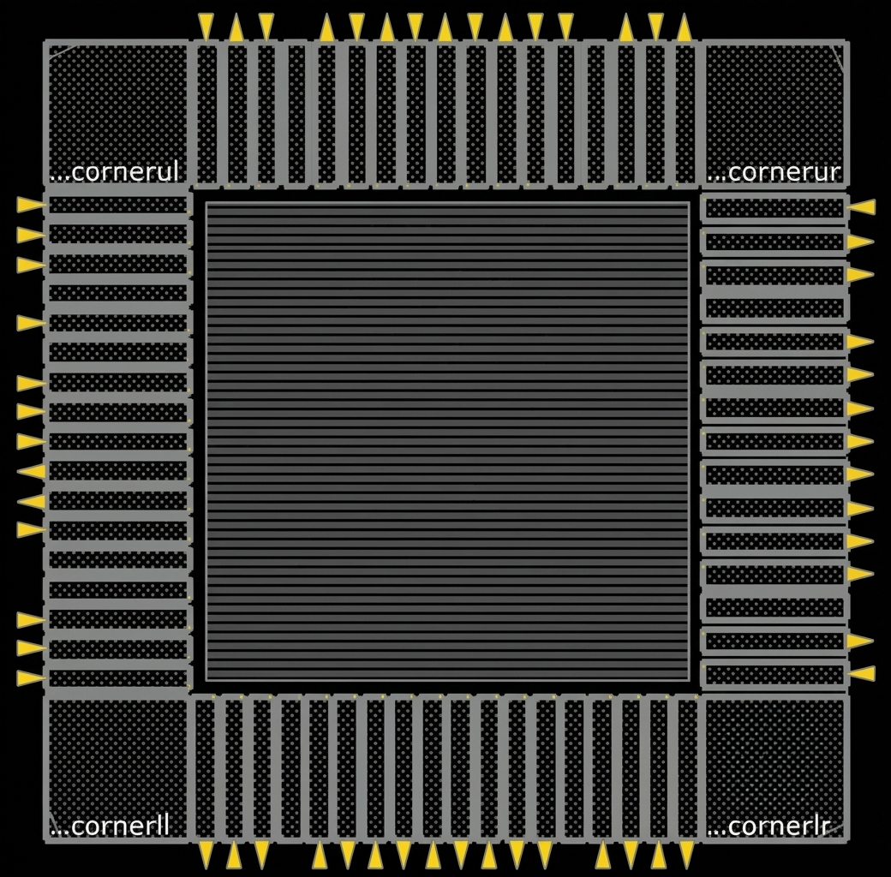
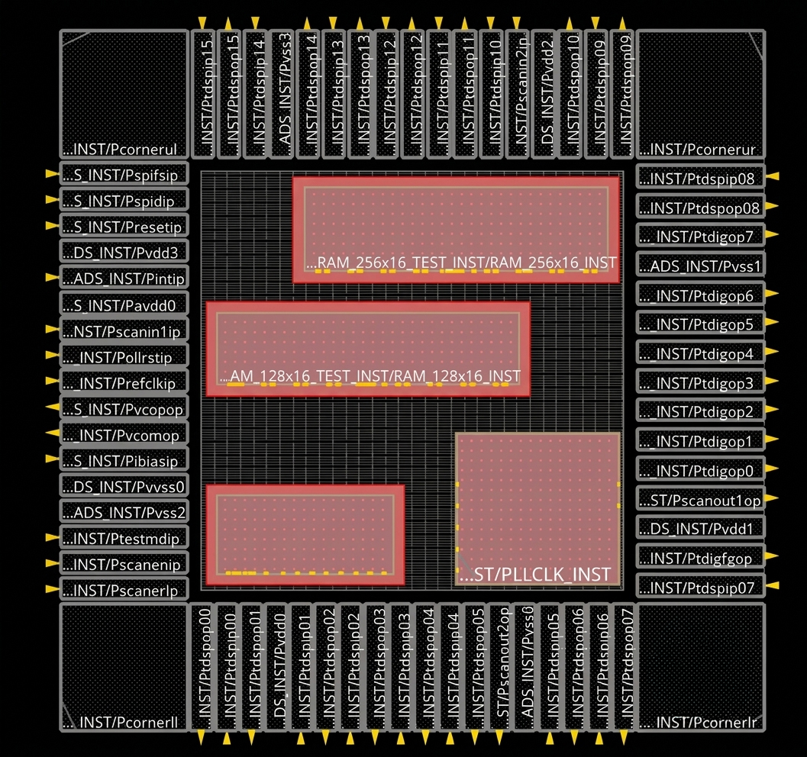
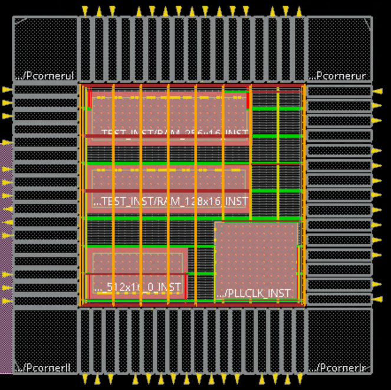
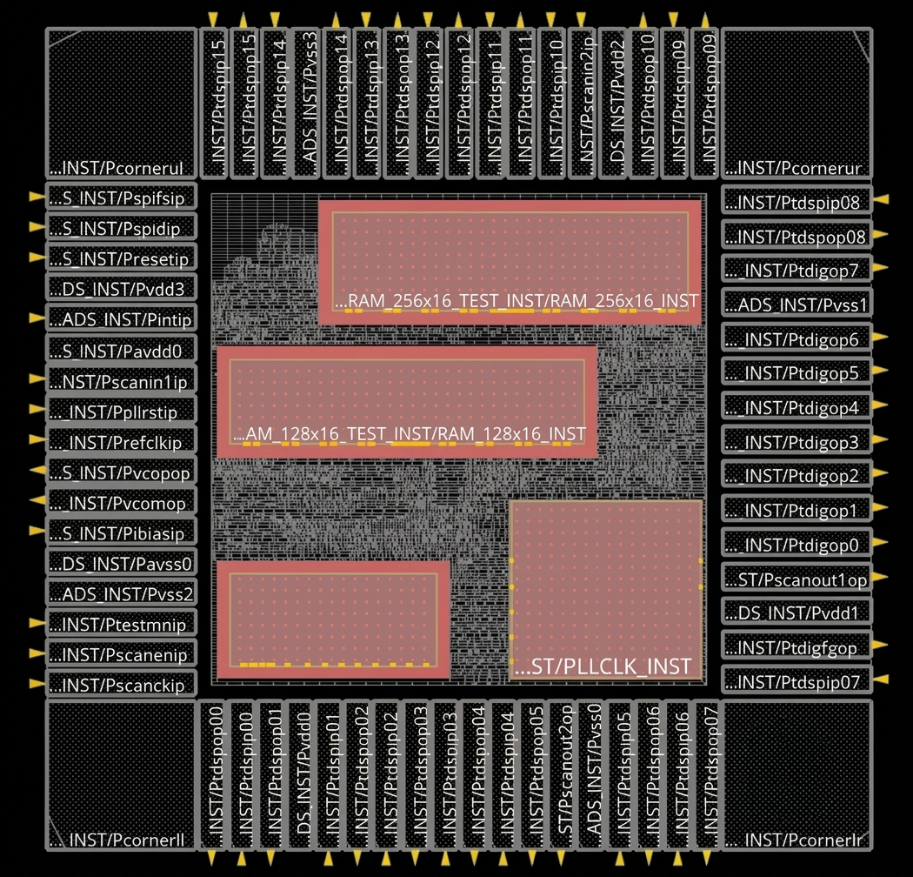
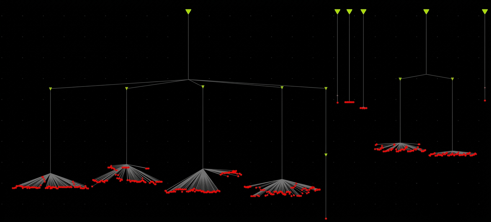
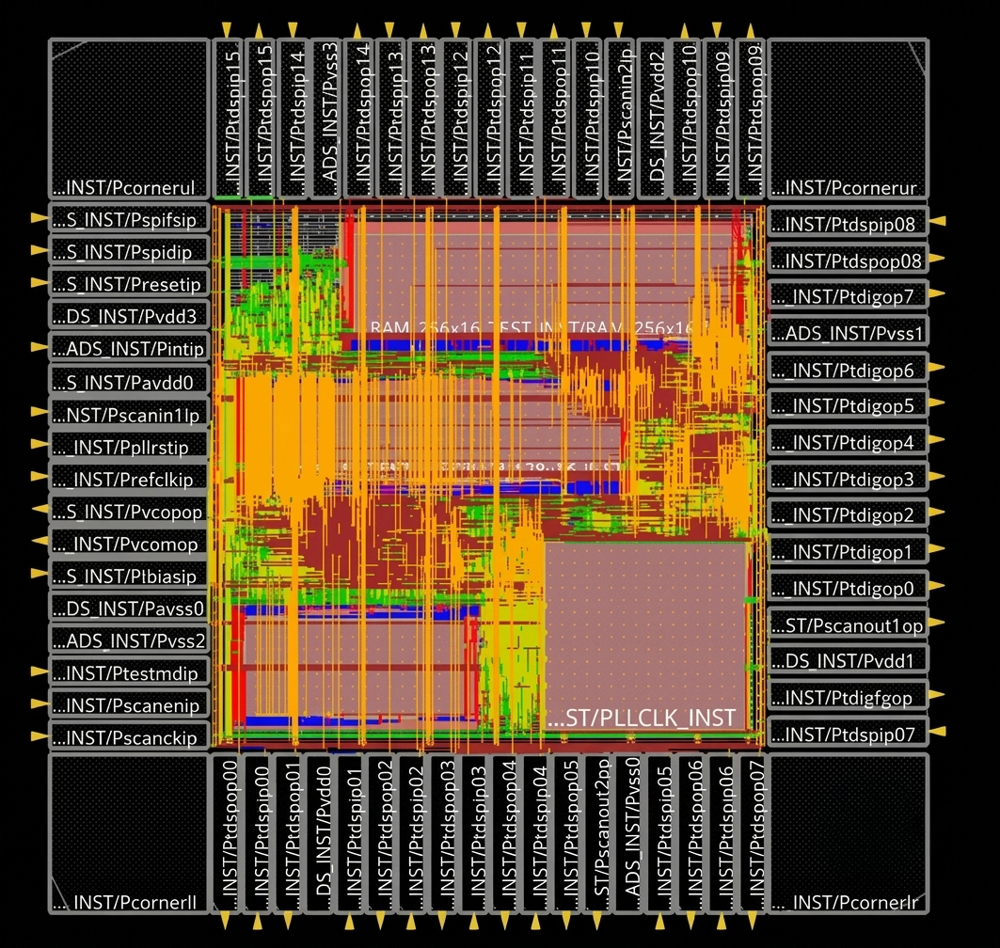

# DTMF_CHIP --- 90nm ASIC Physical Design

> **Hierarchical 90nm ASIC Physical Design implementation using Cadence Innovus — covering design initialization, MMMC constraints, floorplanning, power planning, placement, CTS, routing, timing, power, congestion, parasitic and physical-design analysis.**


```

------------------------------------------------------------------------

## 1. Project Overview

This repository documents the physical design implementation and
analysis of a hierarchical **DTMF_CHIP** design in a **90nm CMOS
technology** using the **Cadence Innovus Implementation System**.

The work covers the major back-end stages of an ASIC implementation
flow, starting from design initialization and floorplanning and
progressing through power planning, placement, clock-tree synthesis,
routing, timing analysis, power analysis, congestion analysis, clock
analysis, parasitic analysis, and implementation-quality auditing.

The design contains a substantial digital processing subsystem together
with memory/test macros, I/O pads, SPI logic, data-path/control logic,
and a PLL/clock-related macro block.

### Primary objective

The objective was to take an existing hierarchical ASIC design database
and carry it through a realistic physical-design flow while studying the
interaction between:

-   Floorplan quality
-   Macro and I/O placement
-   Power distribution
-   Standard-cell placement
-   Clock-tree implementation
-   Setup and hold timing
-   Routing congestion
-   Clock latency and skew
-   Dynamic/internal/leakage power
-   Parasitic extraction/annotation
-   Timing-check coverage
-   Design-rule/DRV closure
-   Tcl-based implementation and reporting

> **Scope note:** This repository represents a physical-design
> implementation and analysis project. The contribution described here
> is primarily the back-end physical implementation, optimization,
> debugging, and analysis rather than RTL microarchitecture development.

------------------------------------------------------------------------

## 2. Project Objectives

The implementation was carried out with the following goals:

-   Understand and execute a hierarchical ASIC physical-design flow.
-   Initialize the design using technology LEF, standard-cell LEF,
    timing libraries, netlists, and constraints.
-   Build and analyze a practical floorplan containing large memory and
    clock-related macros.
-   Perform I/O and macro placement with physical-design considerations.
-   Construct the power-distribution network.
-   Place standard cells and optimize the placement.
-   Prepare the design for clock-tree synthesis.
-   Build the clock tree for multiple clock domains.
-   Analyze clock latency, skew, jitter, and inter-clock relationships.
-   Perform global and detailed routing.
-   Analyze post-route timing using setup and hold checks.
-   Study congestion and density behavior after implementation.
-   Analyze internal, switching, and leakage power.
-   Examine parasitic annotation and delay coverage.
-   Identify remaining implementation-quality limitations such as
    max-fanout violations and untested timing checks.
-   Develop Tcl-based reporting and automation skills within Innovus.

------------------------------------------------------------------------

## 3. My Contribution

My work on this project focused on the ASIC Physical Design
implementation and analysis flow.

### Physical Design

-   Design initialization in Cadence Innovus.
-   Technology and library setup.
-   MMMC/SDC-based timing environment setup.
-   Hierarchical floorplan analysis.
-   I/O pad arrangement and physical planning.
-   Memory and PLL-related macro placement.
-   Power-grid planning.
-   Standard-cell placement.
-   Placement optimization.
-   Pre-CTS preparation.
-   Clock Tree Synthesis.
-   Post-CTS timing optimization.
-   Global routing.
-   Detailed routing.
-   Post-route timing analysis.
-   Setup and hold debugging.

### Analysis and Optimization

-   Timing summary generation.
-   Critical-path analysis.
-   Unconstrained-path analysis.
-   Clock latency analysis.
-   Clock skew analysis.
-   Clock jitter analysis.
-   Inter-clock skew analysis.
-   Congestion analysis.
-   Density analysis.
-   Power analysis.
-   Leakage-power analysis.
-   Parasitic annotation analysis.
-   Timing-check coverage analysis.
-   DRV/fanout analysis.

### Automation

-   Tcl scripting within Cadence Innovus.
-   Automated report generation.
-   Extraction of area and instance statistics.
-   Timing report generation.
-   Clock analysis report generation.
-   Congestion and density reporting.
-   Power reporting.
-   Parasitic reporting.
-   Post-route implementation auditing.

------------------------------------------------------------------------

# 4. Design at a Glance

  Parameter                                                     Value
  ------------------------------------ ------------------------------
  Design                                                  `DTMF_CHIP`
  Technology                                                90nm CMOS
  Physical Design Tool                   Cadence Innovus 20.11-s130_1
  Analysis Method                                          MMMC / OCV
  Supply Voltage                                               1.62 V
  Main Clock                                                  `vclk1`
  Secondary Clock                                             `vclk2`
  `vclk1` Period                                                 7 ns
  `vclk1` Frequency                                       142.857 MHz
  `vclk2` Period                                                14 ns
  `vclk2` Frequency                                        71.429 MHz
  Final Top-Level Instance Count                                6,149
  DTMF Core Instance Count                                      6,077
  I/O Instance Count                                               72
  Reported Total Area                                   1,284,833.181
  Final Setup WNS                                           +0.002 ns
  Final Setup TNS                                                0 ns
  Final Setup FEP                                                   0
  Final Hold Slack                                          +0.002 ns
  Congestion H Usage                                          \~11.4%
  Congestion V Usage                                          \~12.6%
  Horizontal Overflow                                              54
  Vertical Overflow                                                 0
  Total Power                                                 \~84.06
  Leakage Power                                            \~0.004631
  Annotated Nets                                        6,477 / 6,926
  Parasitic Annotation                                         93.52%
  Maximum `vclk1` Skew                                       1.536 ns
  `vclk1` Maximum Launch Latency                             2.036 ns
  `vclk1` Minimum Capture Latency                            0.497 ns
  `vclk2` Maximum Launch Latency                             0.440 ns
  `vclk2` Minimum Capture Latency                           -0.138 ns
  Inter-clock Skew (`vclk1 → vclk2`)                         2.166 ns
  Max-Fanout WNS                                              -85.000
  Max-Fanout TNS                                            -1623.000
  Max-Fanout Violating Endpoints                                  141

> **Important:** The values above correspond to the final set of
> reports/screenshots supplied for this project. Some intermediate
> stages had different instance counts, power, congestion, and timing
> values because the design database was progressively modified and
> optimized.

------------------------------------------------------------------------

# 5. Design Hierarchy

The design is hierarchical rather than being a flat collection of
standard cells.

``` text
DTMF_CHIP
├── DTMF_INST
│   ├── ARB_INST
│   ├── DATA_SAMPLE_MUX_INST
│   ├── DIGIT_REG_INST
│   ├── DMA_INST
│   ├── RAM_128x16_TEST_INST
│   ├── RAM_256x16_TEST_INST
│   ├── RESULTS_CONV_INST
│   ├── SPI_INST
│   ├── TDSP_CORE_INST
│   │   ├── ACCUM_STAT_INST
│   │   ├── ALU_32_INST
│   │   ├── DATA_BUS_MACH_INST
│   │   ├── DECODE_INST
│   │   ├── EXECUTE_INST
│   │   ├── MPY_32_INST
│   │   │   └── M16X16_INST
│   │   ├── PORT_BUS_MACH_INST
│   │   ├── PROG_BUS_MACH_INST
│   │   ├── TDSP_CORE_GLUE_INST
│   │   └── TDSP_CORE_MACH_INST
│   ├── TDSP_DS_CS_INST
│   ├── TDSP_MUX
│   ├── TEST_CONTROL_INST
│   └── ULAW_LIN_CONV_INST
└── IOPADS_INST
```

## Major blocks

### `DTMF_INST`

The main hierarchical digital subsystem containing the DTMF
receiver/core logic and supporting control/data-path blocks.

### `TDSP_CORE_INST`

The largest digital processing hierarchy in the design.

Important sub-blocks include:

-   `ALU_32_INST`
-   `MPY_32_INST`
-   `M16X16_INST`
-   `EXECUTE_INST`
-   `DECODE_INST`
-   `DATA_BUS_MACH_INST`
-   `PROG_BUS_MACH_INST`
-   `PORT_BUS_MACH_INST`
-   `TDSP_CORE_GLUE_INST`
-   `TDSP_CORE_MACH_INST`
-   `ACCUM_STAT_INST`

### Memory blocks

The design contains two explicit test-memory macros:

-   `RAM_128x16_TEST_INST`
-   `RAM_256x16_TEST_INST`

These macros significantly affect floorplan utilization, routing
topology, timing, and power.

### Clock / PLL block

A PLL/clock-related macro is visible in the physical implementation and
contributes to the clocking infrastructure of the chip.

### I/O pads

The final hierarchy contains:

``` text
IOPADS_INST
```

with a reported **72 I/O instances**.

------------------------------------------------------------------------

# 6. Technology and EDA Environment

## Technology

-   90nm CMOS
-   Nominal supply voltage used in the reports: **1.62 V**
-   Standard-cell and physical implementation libraries
-   LEF/DEF-based physical database
-   Liberty timing libraries
-   MMMC timing views
-   OCV analysis

## EDA environment

  Tool / Technology              Usage
  ------------------------------ --------------------------------------
  Cadence Innovus 20.11-s130_1   Physical implementation
  Cadence MMMC                   Multi-mode/multi-corner timing setup
  SDC                            Timing constraints
  LEF                            Physical abstracts
  Liberty                        Timing/power characterization
  SPEF/RCDB                      Parasitic information
  Tcl                            Flow automation and reporting
  Linux x86_64                   Implementation environment

------------------------------------------------------------------------

# 7. Complete Physical Design Flow

``` text
Design Initialization
        │
        ▼
Technology / Library Setup
        │
        ▼
MMMC + SDC Constraints
        │
        ▼
Floorplanning
        │
        ├── I/O Planning
        ├── Macro Planning
        └── Core Area Planning
        │
        ▼
Power Planning
        │
        ├── Power Rings
        ├── Power Stripes
        └── VDD / VSS Distribution
        │
        ▼
Standard-Cell Placement
        │
        ▼
Pre-CTS Optimization
        │
        ▼
Clock Tree Synthesis
        │
        ▼
Post-CTS Optimization
        │
        ▼
Global Routing
        │
        ▼
Detailed Routing
        │
        ▼
Post-Route Optimization
        │
        ▼
Parasitic / RC Analysis
        │
        ▼
STA
 ├── Setup
 ├── Hold
 ├── DRV
 ├── Clock Checks
 └── Unconstrained Paths
        │
        ▼
Power Analysis
        │
        ▼
Congestion / Density Analysis
        │
        ▼
Implementation Quality Audit
```

------------------------------------------------------------------------

# 8. Design Initialization

Design initialization establishes the Innovus database before physical
implementation.

Typical inputs include:

-   Technology LEF
-   Standard-cell LEF
-   Macro LEF
-   Netlist
-   Liberty timing libraries
-   MMMC configuration
-   SDC constraints
-   Power/ground net definitions

Representative Innovus setup commands:

``` tcl
set_db init_power_nets VDD
set_db init_ground_nets VSS

read_physical -lefs {
    <technology_lef>
    <standard_cell_lef>
    <macro_lef>
}

read_netlist <netlist>
read_mmmc <mmmc_file>

init_design
```

The exact file names depend on the project environment and library
organization.

### Initialization checks

After initialization, important checks include:

``` tcl
report_area
report_timing
report_timing_summary
report_analysis_coverage
```

The purpose is to confirm that:

-   The design database loaded correctly.
-   Libraries are available.
-   Timing constraints are recognized.
-   Clocks are created.
-   Hierarchy is preserved.
-   Power/ground connectivity is established.
-   No unexpected missing cells or unresolved references exist.

------------------------------------------------------------------------

# 9. Floorplanning

Floorplanning establishes the physical boundaries of the design and
creates the foundation for every subsequent stage.

The floorplan must account for:

-   Core dimensions
-   Aspect ratio
-   I/O pad locations
-   Macro locations
-   Routing channels
-   Power distribution
-   Standard-cell placement area
-   Clock distribution
-   Congestion risk

## Floorplan GUI



The GUI image shows a complete chip-level floorplan with:

-   Peripheral I/O pads
-   Core boundary
-   Corner structures
-   Central standard-cell region
-   Routing resources
-   Pad-to-core interfaces

## Floorplan macro view



The macro-oriented view shows the large physical blocks inside the core
region.

The major visible macros include:

-   `RAM_256x16_TEST_INST`
-   `RAM_128x16_TEST_INST`
-   A second large memory/macro region
-   `PLLCLK_INST`

### Macro-placement considerations

Macro placement was treated as an important physical-design problem
because large macros:

-   Block routing resources.
-   Create congestion around macro boundaries.
-   Affect clock paths.
-   Increase local density.
-   Influence power-grid distribution.
-   Can create long data paths when placed far apart.
-   Can create routing detours if their interfaces are poorly oriented.

A good macro floorplan should therefore:

-   Keep related blocks reasonably close.
-   Preserve routing channels.
-   Avoid narrow channels between large macros.
-   Leave adequate room for standard cells.
-   Consider power connectivity.
-   Consider clock-network accessibility.
-   Avoid unnecessarily fragmented placement regions.

------------------------------------------------------------------------

# 10. I/O and Macro Placement

The I/O placement contains pads around the four sides of the chip.


The screenshots show the pad-ring structure with:

-   Input/output signal pads
-   Power pads
-   Ground pads
-   Scan/test-related pads
-   Corner cells
-   Macro blocks inside the core

The final hierarchy reports:

``` text
IOPADS_INST = 72 instances
```

### Physical significance

I/O planning affects:

-   Input transition
-   Output delay
-   Wire length
-   Signal integrity
-   Power distribution
-   Routing congestion
-   Package interface assumptions

The physical placement of macros relative to I/O pads also affects the
length and complexity of external signal paths.

------------------------------------------------------------------------

# 11. Power Planning

Power planning creates the physical VDD/VSS distribution network
required by the standard cells and macros.



The power network is responsible for distributing the supply from the
pad-ring region into the core.

Typical Innovus operations include:

``` tcl
addRing
addStripe
sroute
```

or their project-specific equivalents.

Representative configuration concepts:

``` tcl
set_db add_rings_target default
set_db add_rings_orthogonal_only true

# Power ring / stripe configuration
# VDD / VSS nets
# Metal layers
# Width
# Spacing
# Pitch

add_rings ...
add_stripes ...
route_special ...
```

### Power-planning objectives

-   Provide low-resistance VDD/VSS paths.
-   Reduce IR-drop risk.
-   Provide robust macro power access.
-   Avoid PG shorts.
-   Ensure standard-cell rows can connect to the grid.
-   Provide sufficient via connectivity between power layers.
-   Maintain routing resources for signal nets.

### Rail-level power

The final power report shows:

  Rail        Voltage   Total Power   Percentage
  --------- --------- ------------- ------------
  Default      1.62 V       \~19.47     \~23.16%
  VDD          1.62 V       \~64.59     \~76.84%

------------------------------------------------------------------------

# 12. Standard-Cell Placement

Placement determines the physical locations of standard cells while
attempting to optimize:

-   Wire length
-   Timing
-   Congestion
-   Density
-   Power
-   Routability



The placement image shows a highly populated digital core around the
large macro blocks.

### Placement observations

The implementation contains a significant number of standard-cell
instances in the digital processing region.

The final reported hierarchy contains:

``` text
DTMF_CHIP       6,149 instances
DTMF_INST       6,077 instances
IOPADS_INST        72 instances
```

Large contributors include:

-   `TDSP_CORE_INST`
-   `RESULTS_CONV_INST`
-   `MPY_32_INST`
-   `M16X16_INST`
-   `ALU_32_INST`

### Placement challenges

The main placement challenges were:

-   Large embedded macros.
-   Dense digital processing logic.
-   Long datapath connections.
-   Clock-tree requirements.
-   Routing channels around memories.
-   High local density around macro interfaces.

------------------------------------------------------------------------

# 13. Pre-CTS Optimization

Before CTS, the design is optimized while the clock network is not yet
fully constructed.

The main objectives are:

-   Improve data-path timing.
-   Reduce congestion.
-   Resolve placement-related violations.
-   Improve transition and fanout behavior.
-   Prepare the design for clock-tree synthesis.

Typical checks:

``` tcl
report_timing
report_timing_summary
report_congestion -hotspot -overflow
report_density_map
```

The transition from placement to CTS is important because the timing
picture changes significantly after real clock-tree insertion.

------------------------------------------------------------------------

# 14. Clock Tree Synthesis

Clock Tree Synthesis creates a physical clock distribution network from
the clock sources to sequential endpoints.

The design contains two reported clocks:

``` text
vclk1 = 7 ns
vclk2 = 14 ns
```

### Clock periods

``` text
vclk1:
Period    = 7 ns
Frequency = 1 / 7 ns
          = 142.857 MHz
          ≈ 0.143 GHz

vclk2:
Period    = 14 ns
Frequency = 71.429 MHz
          ≈ 0.0714 GHz
```

## Clock-tree GUI



The clock-tree debugger image shows the branching clock distribution
structure and multiple clock sinks.

### CTS objectives

-   Reduce clock skew.
-   Control clock latency.
-   Meet minimum pulse-width requirements.
-   Maintain acceptable transition.
-   Balance launch and capture paths.
-   Reduce clock-related timing uncertainty.
-   Build physically routable clock networks.

------------------------------------------------------------------------

# 15. Clock Latency Analysis

The final clock latency report gives:

### `vclk1`

-   Maximum launch latency: **2.036 ns**
-   Minimum capture latency: **0.497 ns**
-   Maximum skew: **1.536 ns**

The maximum launch latency occurs at:

``` text
DTMF_INST/ARB_INST/ROM_512x16_0_INST/CLK
```

The minimum capture latency occurs at:

``` text
DTMF_INST/TDSP_CORE_INST/DATA_BUS_MACH_INST/data_out_reg_6/CK
```

### `vclk2`

-   Maximum launch latency: **0.440 ns**
-   Minimum capture latency: **-0.138 ns**
-   Maximum skew shown by the final summary: approximately **-0.120 ns**

Representative clock endpoints include:

``` text
DTMF_INST/RESULTS_CONV_INST/r1477_reg_13/CKN
DTMF_INST/RAM_256x16_TEST_INST/RAM_256x16_INST/CLK
```

### Command

``` tcl
report_clock_timing -type latency
```

------------------------------------------------------------------------

# 16. Clock Skew Analysis

Clock skew is the difference between clock arrival times at two
sequential endpoints.

### Final `vclk1`

``` text
Maximum skew = 1.536 ns
```

Example endpoints:

``` text
DTMF_INST/TDSP_CORE_INST/DECODE_INST/ir_reg_0/CK
DTMF_INST/TDSP_CORE_INST/DATA_BUS_MACH_INST/data_out_reg_6/CK
```

Their reported latencies are approximately:

``` text
2.033 ns
0.497 ns
```

giving approximately:

``` text
2.033 - 0.497 = 1.536 ns
```

### Final `vclk2`

The report shows a skew of approximately:

``` text
-0.395 ns
```

for one representative clock-pair view, while the final clock summary
reports approximately:

``` text
-0.120 ns
```

The exact value depends on the endpoint pair selected by the Innovus
report.

### Command

``` tcl
report_clock_timing -type skew
```

------------------------------------------------------------------------

# 17. Clock Jitter Analysis

The clock-jitter report provides clock-specific jitter and early/late
latency information.

### Reported values

  Clock          Jitter   Late Latency   Early Latency
  --------- ----------- -------------- ---------------
  `vclk1`      1.471 ns       2.007 ns        0.536 ns
  `vclk2`     -0.395 ns      -0.130 ns        0.265 ns

Command:

``` tcl
report_clock_timing -type jitter
```

Clock jitter/latency variation must be considered because it changes the
effective timing relationship between launch and capture events.

------------------------------------------------------------------------

# 18. Inter-Clock Skew

The design contains a reported clock relationship:

``` text
vclk1 → vclk2
```

The inter-clock report shows:

``` text
Inter-clock skew = 2.166 ns
```

Representative clock pins include:

``` text
DTMF_INST/TEST_CONTROL_INST/i_150/Y
DTMF_INST/TDSP_CORE_INST/PROG_BUS_MACH_INST/data_out_reg_9/CK
DTMF_INST/TEST_CONTROL_INST/i_156/Y
DTMF_INST/TEST_CONTROL_INST/i_154/Y
DTMF_INST/TEST_CONTROL_INST/i_152/Y
DTMF_INST/TEST_CONTROL_INST/i_160/Y
DTMF_INST/TEST_CONTROL_INST/i_158/Y
DTMF_INST/RAM_256x16_TEST_INST/RAM_256x16_INST/CLK
```

Command:

``` tcl
report_clock_timing -type interclock_skew
```

This analysis is particularly useful in a design where different
sequential blocks operate under different clock periods and phase
relationships.

------------------------------------------------------------------------

# 19. Clock Summary

Command:

``` tcl
report_clock_timing -type summary
```

### Final clock summary

  Clock       Max Launch Latency   Min Capture Latency   Maximum Skew
  --------- -------------------- --------------------- --------------
  `vclk1`               2.036 ns              0.497 ns       1.536 ns
  `vclk2`               0.440 ns             -0.138 ns    \~-0.120 ns

------------------------------------------------------------------------

# 20. Routing

Routing converts logical connectivity into physical metal interconnect.

The routing stage includes:

-   Global routing
-   Track assignment
-   Detailed routing
-   Via insertion
-   Signal connectivity
-   Clock routing
-   Power connectivity
-   Route optimization



The routed GUI shows:

-   Dense horizontal and vertical metal resources.
-   Routed connections between standard cells.
-   Macro boundaries.
-   Clock and signal interconnect.
-   Peripheral pad connections.
-   High routing activity around macro interfaces.

### Routing objectives

-   Complete all required signal connections.
-   Minimize routing congestion.
-   Reduce wire delay.
-   Avoid shorts.
-   Avoid opens.
-   Maintain timing.
-   Preserve power-grid integrity.
-   Resolve routing DRC/DRV issues.

------------------------------------------------------------------------

# 21. Post-Route Optimization

After routing, the physical implementation is analyzed with
extracted/annotated interconnect effects.

The post-route stage focuses on:

-   Setup timing
-   Hold timing
-   Clock latency
-   Clock skew
-   Routing congestion
-   Parasitics
-   Power
-   Fanout
-   Design-rule violations

Representative commands:

``` tcl
report_timing
report_timing_summary
report_timing -unconstrained

report_clock_timing -type latency
report_clock_timing -type skew
report_clock_timing -type jitter
report_clock_timing -type summary
report_clock_timing -type interclock_skew

report_power
report_congestion -hotspot -overflow
report_density_map

report_annotated_delay
report_annotated_parasitics
report_analysis_coverage
```

------------------------------------------------------------------------

# 22. Setup Timing Analysis

The final setup timing summary reports:

``` text
WNS = +0.002 ns
TNS =  0.000 ns
FEP =  0
```

This indicates that the reported setup checks have no negative slack in
the final timing snapshot.

## Representative final setup path

``` text
Startpoint:
DTMF_INST/RESULTS_CONV_INST/r1633_reg_13/CKN

Endpoint:
DTMF_INST/RESULTS_CONV_INST/gt_reg/D

Clock:
vclk1
```

Reported values:

``` text
Capture clock edge = 14.000 ns
Launch clock edge  = 7.000 ns

Setup              = 0.705 ns
Uncertainty        = 0.250 ns
Required time      = 13.558 ns
Launch clock       = 7.034 ns
Data path delay    = 6.522 ns
Slack              = +0.002 ns
```

The timing path contains multiple logic stages, including:

``` text
SDFFNX1
DLX4X1
DLX4X1
NAND2BX1
DFF-related logic
NAND/OR/NOR logic
```

### Interpretation

The path is extremely close to the setup limit:

``` text
WNS = +0.002 ns
```

Therefore, although the reported setup check is met, there is very
little timing margin.

------------------------------------------------------------------------

# 23. Hold Timing Analysis

Hold timing was one of the important optimization problems encountered
during implementation.

## Earlier hold violation

Before final optimization, the report showed:

``` text
Hold Slack = -1.992 ns
```

Representative path:

``` text
Startpoint:
DTMF_INST/SPI_INST/spi_sr_reg_7/CK

Endpoint:
DTMF_INST/SPI_INST/dout_reg_7/D

Clock relationship:
vclk2 → vclk1
```

The negative slack clearly indicated a hold violation.

Another intermediate snapshot showed:

``` text
Hold Slack = -1.975 ns
```

This demonstrates that hold timing was initially not closed.

## Final hold timing

After subsequent optimization, the final report shows:

``` text
Hold Slack = +0.002 ns
```

Representative final path:

``` text
Startpoint:
DTMF_INST/RESULTS_CONV_INST/r1477_reg_0/CKN

Endpoint:
DTMF_INST/RESULTS_CONV_INST/r1477_reg_0/D

Clock:
vclk2
```

Reported values:

``` text
Capture clock edge = 7.000 ns
Launch clock edge  = 7.000 ns

Capture source latency = -0.200 ns
Launch source latency  = -0.199 ns

Capture net latency = 0.214 ns
Launch net latency  = 0.213 ns

Hold = 0.032 ns
Uncertainty = 0.250 ns

Required time = 7.495 ns
Launch clock = 7.014 ns
Data path = 0.483 ns

Final slack = +0.002 ns
```

### Key engineering observation

The implementation successfully moved the representative hold condition
from approximately:

``` text
-1.99 ns
```

to:

``` text
+0.002 ns
```

This is a significant example of post-CTS/post-route timing
optimization.

------------------------------------------------------------------------

# 24. Setup Timing Summary

The final timing-summary report shows:

  Check                   WNS        TNS   FEP
  --------------- ----------- ---------- -----
  Setup --- ALL     +0.002 ns   0.000 ns     0
  `in2out`                N/A        N/A     0
  `reg2out`         +0.028 ns   0.000 ns     0
  `in2reg`                N/A        N/A     0
  `reg2reg`         +0.002 ns   0.000 ns     0

The critical setup group is therefore the `reg2reg` group with a WNS of
approximately **+0.002 ns**.

------------------------------------------------------------------------

# 25. Hold Timing Summary

The final detailed hold report demonstrates positive slack of
approximately:

``` text
+0.002 ns
```

The progression observed in the reports is:

``` text
Intermediate:
-1.992 ns

Later:
-1.975 ns

Final:
+0.002 ns
```

This progression demonstrates the effect of timing optimization and
delay balancing.

------------------------------------------------------------------------

# 26. Unconstrained Timing Analysis

The command:

``` tcl
report_timing -unconstrained
```

was used to identify timing paths that are not fully constrained by the
active timing environment.

One reported path is:

``` text
Startpoint:
DTMF_INST/TDSP_CORE_INST/DECODE_INST/ir_reg_9/CK

Endpoint:
DTMF_INST/TDSP_CORE_INST/EXECUTE_INST/p_reg_30/D

Clock:
vclk1
```

The report shows a data-path delay of approximately:

``` text
14.153 ns
```

The path includes logic through:

``` text
DECODE_INST
TDSP_CORE_GLUE_INST
MPY_32_INST
```

with multiple logic stages and relatively large fanout values.

### Why this report matters

An unconstrained timing report is useful for finding:

-   Missing clock constraints.
-   Missing input delays.
-   Missing output delays.
-   Unexpected clock-domain paths.
-   Paths not covered by the intended timing groups.
-   Potential SDC completeness problems.

Therefore, a zero-violation setup report alone should not be interpreted
as complete timing signoff if significant timing checks remain untested.

------------------------------------------------------------------------

# 27. Clock Checks

The timing summary reports:

  Clock Check                                 WNS   TNS   FEP
  ----------------------------------- ----------- ----- -----
  Minimum pulse width --- endpoints     +1.569 ns     0     0
  Minimum period                        +3.709 ns     0     0

The reported clock checks therefore have positive margin in the supplied
snapshot.

------------------------------------------------------------------------

# 28. Congestion Analysis

Command:

``` tcl
report_congestion -hotspot -overflow
```

The final congestion report shows approximately:

``` text
Horizontal routing usage ≈ 11.4%
Vertical routing usage   ≈ 12.6%
```

The report shows:

``` text
Overflow:
Horizontal = 54
Vertical   = 0
```

The local-hotspot analysis reports:

``` text
Normalized maximum hotspot area = 0.00
Normalized total hotspot area   = 0.00
```

## Congestion interpretation

The overall routing demand is relatively low compared with available
routing capacity, but the remaining **horizontal overflow of 54**
indicates that routing is not completely violation-free.

This distinction is important:

-   Low average routing utilization does not automatically mean zero
    routing violations.
-   Local routing demand can exceed capacity even when average
    utilization is low.
-   Macro boundaries can create localized routing pressure.
-   Horizontal and vertical routing resources can behave differently.

------------------------------------------------------------------------

# 29. Density Analysis

The density map report used:

``` tcl
report_density_map
```

The report specifies:

``` text
Density threshold = 0.750
Total bins        = 256
Grid              = 16 × 16
Bins > 0.750      = 123
Percentage        = 48.05%
```

Density distribution:

  Density Range               Number of Bins   Percentage
  ------------------------- ---------------- ------------
  0.800 -- 0.850                          31       12.11%
  0.950 -- 1.000                           5        1.95%
  0.950 -- 1.000                          87       33.98%
  Total high-density bins                123       48.05%

> The supplied Innovus output contains overlapping textual ranges in the
> displayed table; the reliable aggregate value is **123 / 256 bins =
> 48.05%** above the configured 0.750 threshold.

The reported density distribution unevenness ratio is:

``` text
9.517%
```

### Interpretation

A significant fraction of bins are above the 0.75 density threshold,
which indicates a relatively dense physical implementation.

The unevenness ratio provides an indication of spatial density
non-uniformity.

------------------------------------------------------------------------

# 30. Power Analysis

The final supplied power report gives:

``` text
Total Internal Power     = 76.6808
Total Switching Power   = 7.3711
Total Leakage Power     = 0.004631
Total Power             = 84.0565
```

The reported percentages are approximately:

``` text
Internal   = 91.23%
Switching  = 8.77%
Leakage    = 0.005%
```

## Power breakdown

  Group                     Internal   Switching      Leakage   Total   Percentage
  ----------------------- ---------- ----------- ------------ ------- ------------
  Sequential                   6.477      0.5609     0.001265   7.039       8.374%
  Macro                        46.02      0.1704            0   46.19       54.95%
  I/O                          19.38     0.07096            0   19.45       23.14%
  Combinational                4.455       5.381     0.003316   9.839       11.70%
  Clock (Combinational)        0.350       1.188   0.00004939   1.538        1.83%
  Clock (Sequential)               0           0            0       0           0%

### Major observation

The largest contributor is the **macro category**, accounting for
approximately:

``` text
46.19 / 84.06 ≈ 54.95%
```

of total power.

The I/O category contributes approximately:

``` text
23.14%
```

while combinational logic contributes approximately:

``` text
11.70%
```

------------------------------------------------------------------------

# 31. Clock Power

Clock-related power in the final report:

  Clock       Internal   Switching     Leakage    Total
  --------- ---------- ----------- ----------- --------
  `vclk2`       0.1256       0.280    2.74e-05   0.4056
  `vclk1`       0.2245      0.9079   2.199e-05    1.132
  Total          0.350       1.188   4.939e-05    1.538

The clock network therefore contributes approximately:

``` text
1.538 / 84.0565 ≈ 1.83%
```

of the total reported power.

------------------------------------------------------------------------

# 32. Leakage Power Analysis

The final leakage-power report gives:

``` text
Total leakage power = 0.004631
```

Breakdown:

  Group                       Leakage   Percentage
  ----------------------- ----------- ------------
  Sequential                 0.001265       27.32%
  Macro                             0           0%
  I/O                               0           0%
  Combinational              0.003316       71.61%
  Clock (Combinational)     4.939e-05       1.067%
  Total                      0.004631         100%

The dominant leakage contribution in the reported database is from
**combinational logic**.

------------------------------------------------------------------------

# 33. Parasitic Analysis

The implementation includes post-route parasitic analysis.

Command:

``` tcl
report_annotated_parasitics
```

The final report shows:

``` text
Total nets       = 6,926
Annotated nets   = 6,477
Not annotated    = 449
```

Therefore:

``` text
Annotated = 93.52%
Not annotated = 6.48%
```

For complete physical nets:

``` text
Complete physical nets = 6,534
Annotated = 6,477
```

giving approximately:

``` text
99.13% annotated
```

among complete physical nets.

## Aggregate parasitics

The report gives approximately:

``` text
Resistance = 300.1749 KΩ
Capacitance = 59.4472 pF
```

These values demonstrate that post-route RC effects are being considered
in the implementation analysis.

------------------------------------------------------------------------

# 34. Annotated Delay Analysis

The command:

``` tcl
report_annotated_delay
```

was also evaluated.

The supplied report shows:

``` text
Design Stage: PostRoute
Design Mode: 90nm
Analysis Mode: MMMC OCV
Parasitics Mode: SPEF/RCDB
```

The displayed snapshot reports:

``` text
Cell arcs          = 20,877
Input net arcs     = 288
Internal net arcs  = 16,954
Output net arcs    = 29
All timing arcs    = 37,888
```

At that particular report snapshot, the timing-arc annotation table
shows zero annotated timing arcs.

This should **not** be confused with the separate net-level parasitic
report, which shows **6,477 / 6,926 nets annotated (93.52%)**.

### Important signoff observation

The difference between net-level parasitic annotation and timing-arc
delay annotation indicates that the supplied reports should be treated
as an implementation-analysis snapshot rather than a complete industrial
signoff package.

------------------------------------------------------------------------

# 35. Timing Check Coverage

The command:

``` tcl
report_analysis_coverage
```

produced the following final coverage summary:

  Check Type                  Checks          Met   Violated     Untested
  ------------------------- -------- ------------ ---------- ------------
  Clock Period                     6     6 (100%)          0            0
  External Delay --- Late         25      9 (36%)          0     16 (64%)
  Pulse Width                   1361   1088 (79%)          0    273 (20%)
  Recovery                       269            0          0   269 (100%)
  Setup                         1821    219 (12%)          0   1602 (87%)

### Interpretation

The report shows zero violations in the displayed checks, but a large
number of checks remain untested.

This is especially important for:

-   Recovery checks.
-   Setup coverage.
-   External delay checks.
-   Pulse-width coverage.

Therefore:

> **The design should not be described as fully signoff-clean solely
> from this report.**

A production signoff flow would require complete timing coverage across
all intended modes/corners and complete physical verification.

------------------------------------------------------------------------

# 36. Fanout and DRV Analysis

The timing summary reports a significant max-fanout violation:

``` text
Max Fanout WNS = -85.000
Max Fanout TNS = -1623.000
FEP             = 141
```

Other displayed DRV categories:

``` text
Max transition      = N/A
Min transition      = N/A
Max capacitance     = N/A
Min capacitance     = N/A
Min fanout          = N/A
```

### Interpretation

The design has **141 reported max-fanout violations**.

This means that although setup and hold timing are reported as met in
the final timing snapshot, implementation-quality constraints are not
completely closed.

### Potential engineering fixes

Possible remedies include:

-   Buffer insertion.
-   Fanout splitting.
-   Driver upsizing.
-   Logic restructuring.
-   Improved placement.
-   Replication of high-fanout drivers where appropriate.
-   Clock/data-network optimization.
-   Local buffering near heavily loaded endpoints.

Representative analysis:

``` tcl
report_timing -max_paths 20
report_timing -path_type full_clock
report_timing_summary
```

------------------------------------------------------------------------

# 37. Critical Path Analysis

A representative final setup path is located in:

``` text
DTMF_INST/RESULTS_CONV_INST
```

Path:

``` text
r1633_reg_13/CKN
        │
        ▼
r1633_reg_13/Q
        │
        ▼
FE_PHC265_r1633_13/Y
        │
        ▼
FE_PHC124_r1633_13/Y
        │
        ▼
NAND2BX1
        │
        ▼
multiple combinational stages
        │
        ▼
gt_reg/D
```

The reported data-path delay is:

``` text
6.522 ns
```

against the available timing window, resulting in:

``` text
Slack = +0.002 ns
```

### Engineering interpretation

This path is effectively timing-critical because its remaining setup
margin is only 2 ps.

Any changes to:

-   Cell sizing
-   Placement
-   Routing
-   Clock-tree topology
-   RC extraction
-   Uncertainty
-   Library corner

could potentially change its slack.

------------------------------------------------------------------------

# 38. Timing Optimization Progression

One of the strongest parts of this project is the visible timing
progression.

## Hold

``` text
Initial/intermediate:
-1.992 ns

Later:
-1.975 ns

Final:
+0.002 ns
```

## Setup

``` text
Final:
+0.002 ns
```

## Final timing summary

``` text
Setup WNS = +0.002 ns
Setup TNS = 0 ns
FEP       = 0

Hold representative slack = +0.002 ns
```

This demonstrates that timing optimization was not merely a
report-generation exercise; the implementation database was iteratively
improved.

------------------------------------------------------------------------

# 39. Area Analysis

The final area report shows:

``` text
DTMF_CHIP
Instance Count = 6149
Total Area     = 1284833.181
```

The major hierarchy areas include:

  Hierarchy                  Instances         Area
  ------------------------ ----------- ------------
  `DTMF_INST`                     6077   434109.896
  `ARB_INST`                        25    47723.732
  `DATA_SAMPLE_MUX_INST`            26      648.648
  `DIGIT_REG_INST`                  11      901.454
  `DMA_INST`                        60     1955.923
  `RAM_128x16_TEST_INST`            29    76010.311
  `RAM_256x16_TEST_INST`            26    87964.350
  `RESULTS_CONV_INST`             2029    44114.717
  `SPI_INST`                        91     3313.094
  `TDSP_CORE_INST`                3613    84487.234
  `ALU_32_INST`                    882    12799.987
  `EXECUTE_INST`                   729    22054.032
  `MPY_32_INST`                   1083    25536.773
  `M16X16_INST`                    833    22040.726
  `IOPADS_INST`                     72   850723.285

Command:

``` tcl
report_area
```

### Important area observation

The I/O hierarchy has a very large reported area:

``` text
IOPADS_INST = 850723.285
```

This reflects the physical area contribution of the pad-ring structures
and should not be interpreted as equivalent to standard-cell logic area.

------------------------------------------------------------------------

# 40. Stage-Wise Implementation Summary

  ----------------------------------------------------------------------------
  Stage                   Main Objective          Key Observation
  ----------------------- ----------------------- ----------------------------
  Initialization          Load design and         Hierarchical DTMF database
                          libraries               initialized

  Floorplan               Define chip/core        Large macro and I/O
                          geometry                structures established

  Macro Placement         Place memories/PLL      Major macros distributed
                                                  inside core

  Power Planning          Build VDD/VSS network   Core power distribution
                                                  established

  Placement               Place standard cells    Dense digital logic
                                                  distributed around macros

  Pre-CTS                 Optimize data paths     Prepare design for CTS

  CTS                     Build clock network     Two clocks physically
                                                  distributed

  Post-CTS                Optimize timing         Clock latency/skew analyzed

  Routing                 Complete signal         Dense metal routing visible
                          connectivity            

  Post-Route              Analyze extracted       RC/timing/power/congestion
                          physical effects        evaluated

  Setup STA               Check setup             Final WNS +0.002 ns

  Hold STA                Check hold              Final representative slack
                                                  +0.002 ns

  Clock Analysis          Latency/skew/jitter     `vclk1` max skew 1.536 ns

  Congestion              Check routing capacity  H overflow 54, V overflow 0

  Density                 Check cell distribution 48.05% bins above 0.75
                                                  threshold

  Power                   Analyze power           Total \~84.06

  Parasitics              Check RC annotation     93.52% nets annotated

  Coverage                Audit timing checks     Several checks remain
                                                  untested

  DRV                     Audit fanout            141 max-fanout violations
  ----------------------------------------------------------------------------

------------------------------------------------------------------------

# 41. Physical Design Challenges and Debugging

## Challenge 1 --- Hold timing violation

An intermediate hold report showed:

``` text
Slack = -1.992 ns
```

### Problem

The data arrival relationship was too early relative to the capture
requirement.

### Debug approach

-   Identify the worst hold path.
-   Inspect launch/capture clock latency.
-   Inspect data-path delay.
-   Examine clock-domain relationship.
-   Check whether useful skew or clock-tree imbalance contributed.
-   Analyze placement/routing delay.
-   Apply post-CTS/post-route optimization.

### Result

Final reported representative hold slack:

``` text
+0.002 ns
```

------------------------------------------------------------------------

## Challenge 2 --- Tight setup margin

The final setup path has:

``` text
WNS = +0.002 ns
```

### Problem

The design is technically meeting the displayed setup requirement but
with only 2 ps of margin.

### Debug approach

-   Inspect the full critical path.
-   Identify high-delay cells.
-   Examine fanout.
-   Examine interconnect delay.
-   Analyze clock latency.
-   Review clock skew.
-   Optimize placement and routing where required.

### Result

The displayed setup check is met with:

``` text
WNS = +0.002 ns
TNS = 0
FEP = 0
```

------------------------------------------------------------------------

## Challenge 3 --- Max-fanout violations

The final timing summary shows:

``` text
WNS = -85.000
TNS = -1623.000
FEP = 141
```

for max fanout.

### Possible causes

-   High-fanout control signals.
-   Test/control distribution.
-   Large hierarchical loads.
-   Insufficient buffering.
-   Long physical connections.

### Possible fixes

``` text
Fanout splitting
      ↓
Buffer insertion
      ↓
Driver upsizing
      ↓
Placement optimization
      ↓
Logic restructuring if necessary
```

These violations remain an explicit limitation of the supplied final
snapshot.

------------------------------------------------------------------------

## Challenge 4 --- Congestion overflow

The final congestion report shows:

``` text
Horizontal overflow = 54
Vertical overflow   = 0
```

### Possible causes

-   Macro boundaries.
-   High local connectivity.
-   Long datapaths.
-   I/O-to-core connections.
-   Uneven cell distribution.
-   Limited routing tracks in particular regions.

### Possible fixes

-   Macro relocation.
-   Cell spreading.
-   Placement blockages.
-   Routing-layer optimization.
-   Buffer relocation.
-   Congestion-aware placement.
-   Local logic restructuring.

------------------------------------------------------------------------

## Challenge 5 --- High-density regions

The density report shows:

``` text
123 / 256 bins
= 48.05%
```

above the 0.75 threshold.

### Possible fixes

-   Cell spreading.
-   Macro repositioning.
-   Density-aware placement.
-   Placement blockages.
-   Utilization reduction.
-   Improved floorplan aspect ratio.

------------------------------------------------------------------------

# 42. Tcl and Innovus Automation

A major part of the project involved using Tcl to automate
implementation analysis.

## Area report

``` tcl
report_area
```

## Congestion report

``` tcl
report_congestion -hotspot -overflow
```

## Density report

``` tcl
report_density_map
```

## Power report

``` tcl
report_power
```

## Timing

``` tcl
report_timing
report_timing_summary
report_timing -unconstrained
```

## Clock analysis

``` tcl
report_clock_timing -type latency
report_clock_timing -type skew
report_clock_timing -type jitter
report_clock_timing -type summary
report_clock_timing -type interclock_skew
```

## Coverage

``` tcl
report_analysis_coverage
```

## Parasitics

``` tcl
report_annotated_delay
report_annotated_parasitics
```

------------------------------------------------------------------------

# 43. Example Tcl Reporting Automation

A simplified project-level reporting script can be structured as:

``` tcl
set report_dir "./reports"

file mkdir $report_dir

redirect $report_dir/area.rpt {
    report_area
}

redirect $report_dir/congestion.rpt {
    report_congestion -hotspot -overflow
}

redirect $report_dir/density.rpt {
    report_density_map
}

redirect $report_dir/power.rpt {
    report_power
}

redirect $report_dir/timing.rpt {
    report_timing
}

redirect $report_dir/timing_summary.rpt {
    report_timing_summary
}

redirect $report_dir/unconstrained.rpt {
    report_timing -unconstrained
}

redirect $report_dir/clock_latency.rpt {
    report_clock_timing -type latency
}

redirect $report_dir/clock_skew.rpt {
    report_clock_timing -type skew
}

redirect $report_dir/clock_jitter.rpt {
    report_clock_timing -type jitter
}

redirect $report_dir/interclock_skew.rpt {
    report_clock_timing -type interclock_skew
}

redirect $report_dir/clock_summary.rpt {
    report_clock_timing -type summary
}

redirect $report_dir/coverage.rpt {
    report_analysis_coverage
}

redirect $report_dir/annotated_delay.rpt {
    report_annotated_delay
}

redirect $report_dir/annotated_parasitics.rpt {
    report_annotated_parasitics
}
```

This structure allows a complete post-route audit to be regenerated
consistently.

------------------------------------------------------------------------

# 44. Recommended Automated Design Audit

A practical Innovus automation flow can collect:

``` text
1. Design name
2. Technology
3. Instance count
4. Area
5. Utilization
6. Clock count
7. Clock periods
8. Setup WNS/TNS/FEP
9. Hold WNS/TNS/FEP
10. Max fanout
11. Max transition
12. Max capacitance
13. Congestion overflow
14. Density
15. Total power
16. Internal power
17. Switching power
18. Leakage power
19. Clock power
20. Parasitic annotation
21. Clock latency
22. Clock skew
23. Clock jitter
24. Inter-clock skew
25. Timing coverage
```

This is the type of reporting infrastructure that can be reused across
different ASIC physical-design projects.

------------------------------------------------------------------------

# 45. Key Physical Design Concepts Demonstrated

This project demonstrates practical understanding of:

### Floorplanning

-   Core/die planning
-   Aspect ratio
-   Utilization
-   Macro placement
-   I/O placement
-   Routing channels
-   Macro halos
-   Placement blockages

### Power planning

-   VDD/VSS networks
-   Rings
-   Stripes
-   Standard-cell power connection
-   Macro power connectivity
-   Via connectivity

### Placement

-   Standard-cell placement
-   Density optimization
-   Congestion-aware placement
-   Timing-driven placement

### CTS

-   Clock latency
-   Clock skew
-   Clock jitter
-   Clock balancing
-   Clock endpoints
-   Inter-clock relationships

### Routing

-   Global routing
-   Detailed routing
-   Signal routing
-   Clock routing
-   Via insertion
-   Routing congestion

### STA

-   Setup
-   Hold
-   WNS
-   TNS
-   FEP
-   Clock latency
-   Clock skew
-   Clock uncertainty
-   Data-path delay
-   Required time
-   Arrival time
-   Unconstrained paths

### Physical analysis

-   Congestion
-   Density
-   Parasitics
-   Power
-   Fanout
-   DRV
-   Timing coverage

### Automation

-   Tcl scripting
-   Report automation
-   Database queries
-   Flow monitoring
-   Metric extraction

------------------------------------------------------------------------

# 46. Important Timing Concepts Demonstrated

## Setup

``` text
Setup slack =
Required arrival time - Actual data arrival time
```

A positive setup slack means the data arrives before the required
capture point.

The final displayed setup margin:

``` text
+0.002 ns
```

------------------------------------------------------------------------

## Hold

Hold checks ensure that data does not arrive too early after the capture
edge.

The project demonstrates the transition:

``` text
-1.992 ns
       ↓
timing optimization
       ↓
+0.002 ns
```

------------------------------------------------------------------------

## Clock skew

``` text
Clock skew =
Capture clock arrival - Launch clock arrival
```

The final `vclk1` maximum skew is approximately:

``` text
1.536 ns
```

------------------------------------------------------------------------

## Clock latency

Clock latency represents the delay from the clock source to a particular
clock endpoint.

For `vclk1`:

``` text
Maximum launch latency = 2.036 ns
Minimum capture latency = 0.497 ns
```

------------------------------------------------------------------------

# 47. Power Interpretation

The final power distribution shows that:

``` text
Macro power        ≈ 54.95%
I/O power          ≈ 23.14%
Combinational      ≈ 11.70%
Sequential         ≈ 8.37%
Clock combinational≈ 1.83%
```

Therefore, optimization effort aimed only at standard-cell switching
activity would not necessarily produce the largest total-power
reduction.

The macro and I/O categories dominate the reported total power.

------------------------------------------------------------------------

# 48. Area Interpretation

The final report gives:

``` text
Total instances = 6149
Total reported area = 1284833.181
```

The large I/O area contribution is a consequence of the physical pad
structures.

The digital logic is dominated by:

``` text
TDSP_CORE_INST
RESULTS_CONV_INST
MPY_32_INST
M16X16_INST
ALU_32_INST
```

This gives a useful hierarchy-level view of where physical complexity
resides.

------------------------------------------------------------------------

# 49. Repository Structure

Recommended final repository organization:

``` text
DTMF-CHIP---90nm-ASIC-Physical-Design/
│
├── README.md
│
├── scripts/
│   ├── init.tcl
│   ├── floorplan.tcl
│   ├── powerplan.tcl
│   ├── placement.tcl
│   ├── cts.tcl
│   ├── routing.tcl
│   └── reports.tcl
│
├── constraints/
│   ├── clocks.sdc
│   └── constraints.sdc
│
├── reports/
│   ├── area/
│   │   └── area.rpt
│   │
│   ├── timing/
│   │   ├── setup.rpt
│   │   ├── hold.rpt
│   │   ├── timing_summary.rpt
│   │   └── unconstrained.rpt
│   │
│   ├── clock/
│   │   ├── latency.rpt
│   │   ├── skew.rpt
│   │   ├── jitter.rpt
│   │   ├── summary.rpt
│   │   └── interclock_skew.rpt
│   │
│   ├── power/
│   │   └── power.rpt
│   │
│   ├── congestion/
│   │   └── congestion.rpt
│   │
│   ├── density/
│   │   └── density.rpt
│   │
│   ├── parasitics/
│   │   ├── annotated_delay.rpt
│   │   └── annotated_parasitics.rpt
│   │
│   └── coverage/
│       └── analysis_coverage.rpt
│
├── screenshots/
│   ├── 01_hierarchy.png
│   ├── 02_floorplan.png
│   ├── 03_macro_placement.png
│   ├── 04_power_plan.png
│   ├── 05_placement.png
│   ├── 06_clock_tree.png
│   ├── 07_post_cts.png
│   ├── 08_routing.png
│   ├── 09_setup_timing.png
│   ├── 10_hold_timing.png
│   ├── 11_clock_timing.png
│   ├── 12_congestion.png
│   ├── 13_density_map.png
│   ├── 14_parasitics.png
│   ├── 15_power.png
│   ├── 16_area_report.png
│   ├── 17_timing_summary.png
│   ├── 18_unconstrained_timing.png
│   ├── 19_timing_coverage.png
│   └── 20_leakage_power.png
│
└── docs/
    └── project_notes.md
```

------------------------------------------------------------------------

# 50. Screenshot Mapping

The supplied GUI screenshots should be stored using the following names.

  Supplied Image                Recommended Filename            README Section
  ----------------------------- ------------------------------- -------------------------
  Hierarchy tree                `01_hierarchy.png`              Design Hierarchy
  Initial floorplan             `02_floorplan.png`              Floorplanning
  Macro/I/O view                `03_macro_placement.png`        I/O and Macro Placement
  Power/routing planning view   `04_power_plan.png`             Power Planning
  Placement GUI                 `05_placement.png`              Placement
  Clock-tree debugger           `06_clock_tree.png`             CTS
  Post-CTS GUI                  `07_post_cts.png`               Post-CTS
  Routed GUI                    `08_routing.png`                Routing
  Setup report                  `09_setup_timing.png`           Setup
  Hold report                   `10_hold_timing.png`            Hold
  Clock analysis                `11_clock_timing.png`           Clock Analysis
  Congestion report             `12_congestion.png`             Congestion
  Density map                   `13_density_map.png`            Density
  Parasitic report              `14_parasitics.png`             Parasitics
  Power report                  `15_power.png`                  Power
  Area report                   `16_area_report.png`            Area
  Timing summary                `17_timing_summary.png`         Timing
  Unconstrained timing          `18_unconstrained_timing.png`   Unconstrained
  Analysis coverage             `19_timing_coverage.png`        Coverage
  Leakage report                `20_leakage_power.png`          Leakage

> If the actual repository uses `.jpeg` instead of `.png`, change the
> extensions in the README accordingly.

------------------------------------------------------------------------

# 51. Recommended Stage-Wise Screenshot Layout

Each implementation stage should document three things:

``` text
1. GUI screenshot
2. Corresponding Innovus report
3. Engineering interpretation
```

For example:

``` text
Floorplanning
├── Floorplan GUI
├── Macro placement GUI
├── report_area
└── Physical interpretation

Placement
├── Placement GUI
├── Density
├── Congestion
└── Timing observation

CTS
├── Clock-tree GUI
├── Clock latency
├── Clock skew
├── Clock jitter
└── Inter-clock skew

Routing
├── Routing GUI
├── Congestion
├── Parasitics
├── Setup
├── Hold
└── Power
```

This makes the repository useful as a technical portfolio rather than
simply a collection of screenshots.

------------------------------------------------------------------------

# 52. Final Results

## Area

``` text
Instances       = 6,149
DTMF core       = 6,077
I/O instances   = 72
Area            = 1,284,833.181
```

## Timing

``` text
Setup WNS       = +0.002 ns
Setup TNS       = 0 ns
Setup FEP       = 0

Final hold path = +0.002 ns
```

## Clock

``` text
vclk1 period = 7 ns
vclk1 freq   = 142.857 MHz

vclk2 period = 14 ns
vclk2 freq   = 71.429 MHz
```

``` text
vclk1 max launch latency  = 2.036 ns
vclk1 min capture latency = 0.497 ns
vclk1 max skew            = 1.536 ns

vclk2 max launch latency  = 0.440 ns
vclk2 min capture latency = -0.138 ns

vclk1 → vclk2 inter-clock skew = 2.166 ns
```

## Congestion

``` text
Horizontal usage = ~11.4%
Vertical usage   = ~12.6%

Horizontal overflow = 54
Vertical overflow   = 0

Normalized hotspot area = 0
```

## Density

``` text
Bins                 = 256
Bins > 0.750         = 123
Percentage           = 48.05%
Unevenness ratio     = 9.517%
```

## Power

``` text
Internal power  = 76.6808
Switching power= 7.3711
Leakage power  = 0.004631
Total power    = 84.0565
```

## Parasitics

``` text
Total nets      = 6926
Annotated nets  = 6477
Annotation      = 93.52%

Resistance      = 300.1749 KΩ
Capacitance     = 59.4472 pF
```

## DRV

``` text
Max fanout WNS = -85.000
Max fanout TNS = -1623.000
Violating endpoints = 141
```

------------------------------------------------------------------------

# 53. Final Implementation Assessment

The final implementation demonstrates successful completion of the major
physical-design stages:

-   Floorplanning
-   Macro placement
-   Power planning
-   Standard-cell placement
-   CTS
-   Routing
-   Post-route timing analysis
-   Clock analysis
-   Power analysis
-   Congestion analysis
-   Density analysis
-   Parasitic analysis
-   Timing coverage analysis

The supplied final timing snapshot reports:

``` text
Setup WNS = +0.002 ns
Setup TNS = 0
Hold representative slack = +0.002 ns
```

This shows successful closure of the displayed critical setup and
representative hold paths.

However, the design is **not claimed as complete production signoff**
because the supplied reports also show:

-   141 max-fanout violations.
-   54 horizontal routing overflow.
-   Significant untested timing checks.
-   100% untested recovery checks in the displayed coverage report.
-   87% of setup checks untested in the displayed coverage summary.
-   64% of late external-delay checks untested.
-   20% of pulse-width checks untested.
-   A difference between net-level parasitic annotation and timing-arc
    annotation in the supplied reports.
-   No evidence in the supplied screenshots of complete final
    DRC/LVS/antenna/IR-drop/EM signoff.

Therefore, the correct engineering description is:

> **Post-route physical implementation and timing/power/congestion
> analysis completed, with the displayed critical setup and hold paths
> closed, but additional signoff verification and remaining
> DRV/routing/coverage issues require further closure before production
> signoff.**

------------------------------------------------------------------------

# 54. What This Project Demonstrates for a Physical Design Resume

This project provides practical evidence of experience with:

``` text
ASIC Physical Design
Cadence Innovus
90nm CMOS
MMMC
OCV
SDC
Floorplanning
Macro Placement
I/O Planning
Power Planning
Standard-Cell Placement
Placement Optimization
Clock Tree Synthesis
Clock Latency
Clock Skew
Clock Jitter
Inter-Clock Analysis
Global Routing
Detailed Routing
Post-Route Optimization
Static Timing Analysis
Setup Timing
Hold Timing
Unconstrained Timing
DRV Analysis
Fanout Analysis
Congestion Analysis
Density Analysis
Power Analysis
Leakage Analysis
Parasitic Analysis
Timing Coverage
Tcl Automation
Physical Design Debugging
```

------------------------------------------------------------------------

# 55. Resume-Ready Project Description

### DTMF_CHIP --- 90nm ASIC Physical Design

-   Implemented a hierarchical DTMF ASIC physical-design flow in Cadence
    Innovus 20.11 across floorplanning, macro/I/O placement, power
    planning, placement, CTS, routing, and post-route analysis.
-   Analyzed a 6,149-instance design with 72 I/O instances and multiple
    embedded memory/clock macros using MMMC/OCV timing methodology.
-   Achieved **+0.002 ns setup WNS / 0 ns TNS** and improved a
    representative hold violation from approximately **-1.99 ns to
    +0.002 ns** through timing optimization.
-   Performed clock latency, skew, jitter, inter-clock skew, congestion,
    density, power, parasitic, timing-coverage, and DRV analysis using
    Tcl-automated Innovus reports.
-   Identified **141 max-fanout violations**, **54 horizontal routing
    overflow**, and incomplete timing-check coverage, demonstrating
    practical post-route debugging and signoff-awareness.

------------------------------------------------------------------------

# 56. Interview Discussion Points

This project can be used to discuss:

### Floorplan

-   Why macros were placed inside the core.
-   How macro placement affects congestion.
-   Why I/O planning matters.
-   Why routing channels are important.

### Power

-   Difference between power rings and stripes.
-   VDD/VSS distribution.
-   Via connectivity.
-   IR-drop considerations.
-   Macro power requirements.

### Placement

-   Timing-driven placement.
-   Congestion-driven placement.
-   Density optimization.
-   High-fanout nets.

### CTS

-   Clock latency.
-   Clock skew.
-   Useful skew.
-   Clock balancing.
-   Clock jitter.
-   Clock uncertainty.
-   Inter-clock skew.

### STA

-   Setup equation.
-   Hold equation.
-   WNS/TNS/FEP.
-   Data arrival time.
-   Required arrival time.
-   Launch/capture clock latency.
-   Clock uncertainty.
-   OCV.
-   Unconstrained paths.

### Routing

-   Global vs detailed routing.
-   Routing overflow.
-   Horizontal vs vertical congestion.
-   Via insertion.
-   Post-route optimization.

### Power

-   Internal power.
-   Switching power.
-   Leakage power.
-   Clock power.
-   Macro power dominance.

### Signoff

-   DRC.
-   LVS.
-   Antenna.
-   IR drop.
-   EM.
-   SPEF.
-   MMMC. 
-   Timing coverage.
-   DRV closure.

------------------------------------------------------------------------

# 57. Why the Project Is Technically Interesting

This is not simply a small standard-cell demonstration.

The physical database contains:

-   A hierarchical digital processing core.
-   Multiple memory macros.
-   A PLL/clock-related macro.
-   Multiple clock domains.
-   Thousands of instances.
-   Large I/O structures.
-   Significant clock latency variation.
-   Inter-clock timing relationships.
-   Post-route parasitic information.
-   Timing and DRV challenges.

The project therefore provides a useful example of how physical design
becomes an optimization problem involving several competing objectives:

``` text
Timing
   ↕
Power
   ↕
Area
   ↕
Congestion
   ↕
Density
   ↕
Routing
   ↕
DRVs
```

Improving one metric can affect another, which is why physical design
requires iterative analysis rather than a single linear tool run.

------------------------------------------------------------------------

# 58. References / Further Study

Useful topics for further study while working with this repository:

-   Cadence Innovus Implementation System documentation
-   Static Timing Analysis
-   SDC constraints
-   MMMC timing analysis
-   OCV and variation analysis
-   Clock Tree Synthesis
-   ASIC floorplanning
-   Power planning
-   Placement optimization
-   Global and detailed routing
-   SPEF parasitic extraction
-   IR-drop and electromigration
-   DRC/LVS/antenna verification

------------------------------------------------------------------------

# 59. Author

**K V Surya Vineeth**

B.Tech --- Electronics and Communication Engineering\
Institute of Aeronautical Engineering, Hyderabad

Areas of interest:

-   ASIC Physical Design
-   VLSI
-   RTL-to-GDSII
-   Static Timing Analysis
-   Physical Design Automation
-   Tcl Scripting
-   Low-Power VLSI
-   Digital IC Design

GitHub:

https://github.com/Vineeth-2k4

------------------------------------------------------------------------

# 60. Conclusion

The DTMF_CHIP project provided hands-on exposure to a realistic
hierarchical ASIC physical-design flow using Cadence Innovus in a 90nm
technology environment.

The project covered the complete implementation path from:

``` text
Design Initialization
        ↓
Floorplanning
        ↓
Macro / I/O Placement
        ↓
Power Planning
        ↓
Placement
        ↓
Pre-CTS Optimization
        ↓
CTS
        ↓
Post-CTS Optimization
        ↓
Routing
        ↓
Post-Route Analysis
        ↓
STA / Power / Congestion / Parasitics
        ↓
Implementation Audit
```

The final supplied reports demonstrate:

-   **6,149 total instances**
-   **1,284,833.181 reported area**
-   **7 ns / 142.857 MHz `vclk1`**
-   **14 ns / 71.429 MHz `vclk2`**
-   **+0.002 ns setup WNS**
-   **0 ns setup TNS**
-   **+0.002 ns representative final hold slack**
-   **1.536 ns maximum `vclk1` skew**
-   **2.166 ns inter-clock skew**
-   **\~84.06 total reported power**
-   **93.52% net-level parasitic annotation**
-   **11.4% horizontal and 12.6% vertical routing usage**
-   **54 horizontal overflow / 0 vertical overflow**
-   **9.517% density unevenness**
-   **141 max-fanout violations**

Most importantly, the project demonstrates the iterative nature of
physical design: timing, congestion, power, clocking, parasitics, and
design-rule constraints must be analyzed together, and improvements must
be validated after each implementation stage.

> **Project status:** Post-route implementation and analysis completed
> for the supplied database snapshots. Critical displayed setup/hold
> timing paths are closed, while additional DRV, routing,
> timing-coverage, and full physical-signoff checks remain for complete
> production closure.
